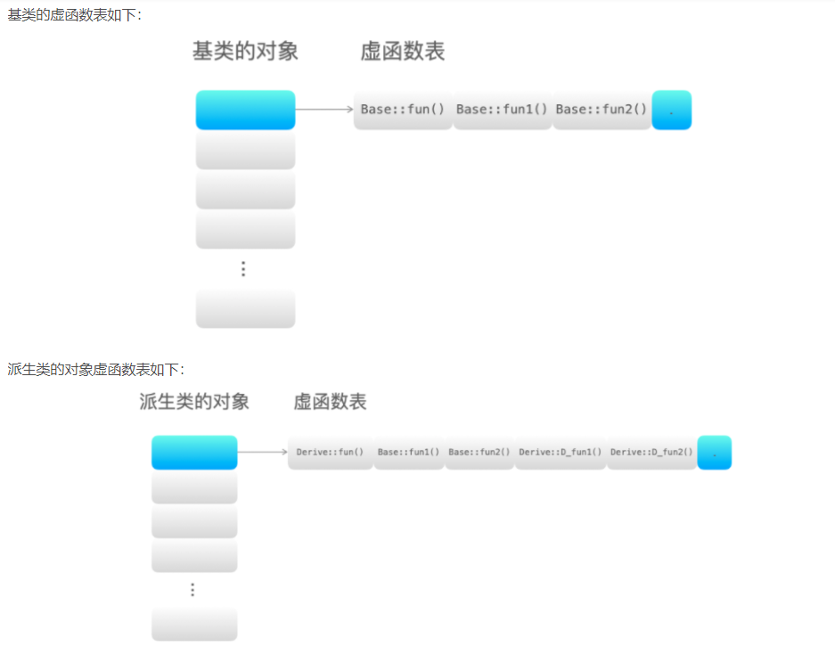

## 1. 编译

C++文件编译执行过程

.cpp文件先翻译成汇编文件.s，然后汇编成机器指令文件.o，.o文件不能立即被机器运行是因为不同的cpp文件中的共用变量等需要被链接到一起，所以需要再生成可执行文件.exe

从.o到.exe的链接分两种：

- 动态链接：只把用到的共享对象的名字等信息记录下来，映射到虚拟地址空间；
- 静态链接：拷贝目标文件到可执行程序中，都装入虚拟地址空间；

# 内存 

## 2. 内存

内存分区：

栈：系统自动分配，局部变量，函数参数，返回地址等；是一块儿连续的内存空间；由编译器自动分配和释放；无内存碎片

堆：程序员手动申请分配，一般存放数组、结构体等数据；由链表维护，不是连续的内存空间；程序结束后由操作系统回收；可能有内存碎片

静态存储区，常量存储区：存放全局变量，静态变量和常量; 由操作系统回收

代码段：存放代码，不允许修改，编译后的.exe二进制文件存放在这里

## 3. 变量

全局变量：在一个.cpp文件定义，其他.cpp文件通过extern也可以使用该变量；C++要求变量只能定义一次，所以不能放在头文件中定义，但可以在头文件中声明；

静态全局变量：将全局变量的作用域局限在当前的.cpp文件，其他源文件不能引用；

局部变量：作用域仅限函数内部，存放在栈中，其他变量存放在静态存储区

静态局部变量：定义在函数内部，只在函数第一次运行时初始化一次。但会一直保存变量值直到程序结束。

## 4. 内存对齐

提高内存读取效率，CPU读取内存是分块的；

不同硬件设备不支持任意地址的数据访问，只支持在特定地址上访问存取数据；


编译器有“对齐系数”，结构体有最长数据类型。从两者得到对齐单位。结构体的大小为对齐单位的整数倍，不够的地方用填充字节。


## 5. 内存泄露

- 常指堆内存泄露，堆是程序员动态分配的。比如malloc之后没有及时free；  解决堆内存泄露的做法是：将内存封装在类中，并在构造的时候申请内存，在析构的时候释放内存。

- 指针重新赋值也会导致内存泄露。给指针p指向了一块儿内存，但是之后又让他指向了别处，一开始那块儿内存就被浪费了。  解决方案：智能指针。

  ```c++
  char *p = (char *)malloc(10);
  char *p1 = (char *)malloc(10);
  p = np;
  ```

## 6. 智能指针

解决内存泄露和对同一块内存空间多次释放，通过**\<memory\>**头文件使用

- shared_ptr 共享指针，通过use_count()计数，当调用一次release()释放的时候，计数减一，当计数为0则自动释放内存空间；

```c++
#include <iostream>
#include <memory>

template <typename T>
class SmartPtr
{
private : 
	T *_ptr;
	size_t *_count;

public:
	SmartPtr(T *ptr = nullptr) : _ptr(ptr)
	{
		if (_ptr)
		{
			_count = new size_t(1);
		}
		else
		{
			_count = new size_t(0);
		}
	}

	~SmartPtr()
	{
		(*this->_count)--;
		if (*this->_count == 0)
		{
			delete this->_ptr;
			delete this->_count;
		}
	}

	SmartPtr(const SmartPtr &ptr) // 拷贝构造：计数 +1
	{
		if (this != &ptr)
		{
			this->_ptr = ptr._ptr;
			this->_count = ptr._count;
			(*this->_count)++;
		}
	}

	SmartPtr &operator=(const SmartPtr &ptr) // 赋值运算符重载 
	{
		if (this->_ptr == ptr._ptr)
		{
			return *this;
		}
		if (this->_ptr) // 将当前的 ptr 指向的原来的空间的计数 -1
		{
			(*this->_count)--;
			if (this->_count == 0)
			{
				delete this->_ptr;
				delete this->_count;
			}
		}
		this->_ptr = ptr._ptr;
		this->_count = ptr._count;
		(*this->_count)++; // 此时 ptr 指向了新赋值的空间，该空间的计数 +1
		return *this;
	}

	T &operator*()
	{
		assert(this->_ptr == nullptr);
		return *(this->_ptr);
	}

	T *operator->()
	{
		assert(this->_ptr == nullptr);
		return this->_ptr;
	}

	size_t use_count()
	{
		return *this->count;
	}
};

```

- unique_ptr 独占指针，资源只能被一个指针占有，资源只能通过move()函数移动赋值给另一个独占指针

  ```c++
  // A 作为一个类 
  std::unique_ptr<A> ptr1(new A());
  std::unique_ptr<A> ptr2 = std::move(ptr1);
  ```

- weak_ptr 弱指针，解决循环引用的问题

### 循环引用

在两个类中分别定义对另一个类的对象的共享指针，当两个类的对象想要执行析构函数释放内存时，由于两个类的shared_ptr互指，无法析构。当我们想要parent对象释放时，children对象中仍保留了该parent对象的shared_ptr，导致其无法被正常释放。既然是因为children对象保留了引用，那么就先释放children对象呗？很好，parent对象中保留了该children对象的shared_ptr。


```c++
#include <iostream>
#include <vector>
#include <memory>

using namespace std;

class parent;
class children;

class parent {
public:
    ~parent() { std::cout << "~parent()" << std::endl; }

public:
    std::shared_ptr<children> child;
};

class children {
public:
    ~children() { std::cout << "~children()" << std::endl; }

public:
    std::shared_ptr<parent> parent;
};

void Verify() {
    std::shared_ptr<parent> p(new parent);
    std::shared_ptr<children> c(new children);

    p->child = c;
    c->parent = p;
}

int main() {
    std::cout << "Begin" << std::endl;

    Verify();

    std::cout << "Done" << std::endl;
}
```

解决方法是使用弱指针，仅保持对对象的引用，而不负责管理资源，但是提供了expired()接口，方便检测引用的对象是否已经释放。

```c++
class parent {
public:
    ~parent() { std::cout << "~parent()" << std::endl; }

public:
    std::shared_ptr<children> child;
};

class children {
public:
    ~children() { std::cout << "~children()" << std::endl; }

public:
    std::weak_ptr<parent> parent;	// 替换成“弱引用”
};
```

# 新特性

- auto关键字，自动类型推导，必须有初始值。编译时通过初始值推断变量类型。

- lambda表达式，常用于排序

```c++
[capture list] (parameter list) -> returnType
{
   function body;
};

[局部变量列表](参数列表)->返回值类型{函数体};

#include <iostream>
#include <algorithm>
using namespace std;

int main()
{
    int arr[4] = {4, 2, 3, 1};
    //对 a 数组中的元素进行升序排序
    sort(arr, arr+4, [=](int x, int y) -> bool{ return x < y; } );
    for(int n : arr){
        cout << n << " ";
    }
    return 0;
}

```

- for语句

  ```
  for (declaration : expression){
      statement
  }
  ```

  

- 右值引用，只能绑定到要销毁的对象，用来移动拷贝。可以加速。 int &&r_val = var;
- move()函数
- 智能指针
- default() 默认构造函数和析构函数

# 面向对象

封装、继承、多态

比如camera类，model类等，把相似功能的操作封装在一个类中，需要使用的时候，直接实例化该类为camera对象或model对象，该对象就可以直接调用该类的接口和成员变量，相当于赋予了特定对象的某些属性。

## 1. 重写和重载

重载是在同一个类中，相同的函数名但是有不同的参数列表，从而有不一样的函数功能。

重写是在基类和派生类中，必须有相同的函数名和参数列表，但是有不一样的函数体。基类中的被重写函数一定是虚函数 virtual

## 2. 多态

多态主要靠 重写和虚函数实现。基类中的函数被`virtual`指定为虚函数，就可以在派生类中被重写。程序运行时会根据对象类型（基类或不同的派生类）来决定执行哪一个函数。

每一个类的虚函数的地址会保存在虚函数表中，虚函数表按照虚函数在类内的声明顺序存放各个虚函数的地址，某类的所有对象都共用一个虚函数表，并把虚函数表的地址保存在每个对象的内存空间开头称为 `vptr指针`，方便索引到虚函数。

实现过程：

1. 基类用`virtual`修饰虚函数，基类有一个自己的虚函数表，基类对象指向该虚函数表
2. 派生类重写虚函数，派生类继承基类的其他未被重写的虚函数，并有一个自己的虚函数表，派生类的对象指向该派生类的虚函数表
3. 派生类对象被基类指针实例化，如果要调用某个虚函数，则基类指针通过派生类对象的内存空间首地址指向并检索派生类的虚函数表，调用相应的虚函数。

```c++
#include <iostream>
using namespace std;

class Base	// 基类，有三个虚函数
{
public:
	virtual void fun() { cout << "Base::fun()" << endl; }
	virtual void fun1() { cout << "Base::fun1()" << endl; }
	virtual void fun2() { cout << "Base::fun2()" << endl; }
};
class Derive : public Base	// 子类，有五个虚函数，分别是Derive::fun(), Base::fun1(),Base::fun2(),Derive::fun1(),Derive::fun2()
{
public:
	void fun() { cout << "Derive::fun()" << endl; }
	virtual void D_fun1() { cout << "Derive::D_fun1()" << endl; }
	virtual void D_fun2() { cout << "Derive::D_fun2()" << endl; }
};
int main()
{
	Base *p = new Derive();		// 基类指针指向子类的对象
	p->fun(); // 调用子类的虚函数Derive::fun() 
	return 0;
}
```



## 3. 虚函数

目的：允许使用基类指针来调用派生类的函数

```c++
#include <iostream>
using namespace std;

class A
{
public:
    virtual void v_fun() // 虚函数
    {
        cout << "A::v_fun()" << endl;
    }
};
class B : public A
{
public:
    void v_fun()
    {
        cout << "B::v_fun()" << endl;
    }
};
int main()
{
    A *p = new B();
    p->v_fun(); // B::v_fun()
    return 0;
}

```

实现机制：

一个类维护一个虚函数表，按照虚函数声明顺序在虚函数表中依次保留虚函数的地址，该类的对象的内存空间的开头有一个指向该虚函数表的地址，虚表指针。类的对象调用虚函数时，通过虚表指针检索虚函数表得到相应的虚函数。虚函数表避免了基类和子类继承过程中的成员函数覆盖问题，当用基类指针操作子类对象的时候，可以通过虚函数表调用虚函数。


多继承有虚函数覆盖的情况。

```c++
#include <iostream>
using namespace std;

class Base1
{
public:
    virtual void fun1() { cout << "Base1::fun1()" << endl; }
    virtual void B1_fun2() { cout << "Base1::B1_fun2()" << endl; }
    virtual void B1_fun3() { cout << "Base1::B1_fun3()" << endl; }
};
class Base2
{
public:
    virtual void fun1() { cout << "Base2::fun1()" << endl; }
    virtual void B2_fun2() { cout << "Base2::B2_fun2()" << endl; }
    virtual void B2_fun3() { cout << "Base2::B2_fun3()" << endl; }
};
class Base3
{
public:
    virtual void fun1() { cout << "Base3::fun1()" << endl; }
    virtual void B3_fun2() { cout << "Base3::B3_fun2()" << endl; }
    virtual void B3_fun3() { cout << "Base3::B3_fun3()" << endl; }
};

class Derive : public Base1, public Base2, public Base3
{
public:
    virtual void fun1() { cout << "Derive::fun1()" << endl; }
    virtual void D_fun2() { cout << "Derive::D_fun2()" << endl; }
    virtual void D_fun3() { cout << "Derive::D_fun3()" << endl; }
};

int main(){
    Base1 *p1 = new Derive();
    Base2 *p2 = new Derive();
    Base3 *p3 = new Derive();
    p1->fun1(); // Derive::fun1()
    p2->fun1(); // Derive::fun1()
    p3->fun1(); // Derive::fun1()
    return 0;
}
```


派生类重写了三个基类的fun1()函数，继承了三个基类的其他函数


## 4. 纯虚函数

纯虚函数：在基类中定义一种虚拟函数，没有定义和实现，但是要求派生类必须定义并实现纯虚函数。

```
virtual void fun() = 0;
```

适用情况：

- 基类不需要实例化的时候。比如动物这个基类，是没办法实例化的，只能是它的派生类如猫可以实例化。因此需要用纯虚函数，基类成为抽象类。
- 让所有的派生类对象都可以执行纯虚函数的动作，但是基类无法提供一个合理的默认实现；

# 关键字

## 1. explicit

修饰 类的单个参数的构造函数，防止隐性调用构造函数。

不能修饰多个参数和无参的构造函数，因为这样的构造函数必须显式调用。

```c++
#include <iostream>
#include <cstring>
using namespace std;

class A
{
public:
    int var;
    A(int tmp)
    {
        var = tmp;
    }
};
int main()
{
    A ex = 10; // 发生了隐式调用构造函数A(int tmp){}
    return 0;
}
```

如果用explicit修饰，这样的隐式调用就不能这么写。

```c++
#include <iostream>
#include <cstring>
using namespace std;

class A
{
public:
    int var;
    explicit A(int tmp)
    {
        var = tmp;
        cout << var << endl;
    }
};
int main()
{
    A ex(100);
    A ex1 = 10; // error: conversion from 'int' to non-scalar type 'A' requested
    return 0;
}
```

## 2. static

全局静态变量，将变量作用域限制在当前的源文件中；

局部静态变量，将变量的生命周期延长到程序运行结束之后，作用域不变；

类中的静态变量和静态函数，可以不用实例化该类，直接用 类名.变量名/函数名 即可调用该成员。

类中的静态函数不能声明成虚函数、const函数，也不能调用非静态成员变量，因为静态成员函数没有this指针。

||

this指针存在于类的非静态成员函数中，只有在对象被创建后才会给this赋值，赋值过程是编译器自动进行的，它指向被调用函数所在的对象，用户无法对this显式赋值。通过this指针可以访问当前对象的所有成员。this是成员函数的一个额外的隐式形参，在调用对象的成员函数时将对象的地址作为参数传递给this。

||

## 3. const

 const相比于宏常量，可以执行**类型检查**，使用宏常量只是进行字符替换，会产生预料不到的错误；同时**define无论是否用到都要占用代码段**的控件，而const常量在静态存储区，只有用到const变量时才会占用空间。

cosnt修饰函数的参数，可以防止参数被修改；修饰函数的形参是没有意义的，但是**当函数参数是指针或者引用时，有必要用const修饰**

## 4. typedef

给类型取别名

## 5. inline

类内成员函数默认都是inline函数，编译器会自动将构造函数、析构函数、普通成员函数 声明为内联函数。

类外定义成员函数，需要inline 才能定义内联函数。

**内联函数在调用时直接在调用点展开，大大减少函数调用的开销。**

普通函数的调用机制：程序执行转移到函数的地址，并保存现场，进行参数压栈等操作，return之后返回到现场，继续执行下面的代码。

内联函数的调用机制：在编译阶段，将内联函数的调用点处嵌入函数体到语句块中，编译器将程序中出现内联函数的调用表达式替换为内联函数的函数体。

## 6. malloc new

动态分配内存，堆

malloc若分配成功，返回指向该内存的指针，若分配失败，返回NULL指针；

new若分配成功，返回该对象类型的指针；分配失败，抛出bac_alloc异常；

```
int *p = new int[5];
```

## 7. delete

调用对象所属类的析构函数，进而调用operator delete的库函数释放内存

delete[] 释放数组空间，对数组中的成员各调用一次析构函数

## 8. volatile

多个线程共用一个变量时，并且变量有可能被改变时，需要用volatile修饰

## 9. memcpy strcpy

memcpy 将连续字节的数据复制到另一个地址

strcpy 拷贝字符串到另一个地址的连续空间，但是并不会检查原来字符串的边界，可能覆盖其他变量。

## 10. include

引用标准库头文件用include <文件名>

引用自己定义的头文件用 include "文件名"

# 指针

## 引用

指针指向的内存空间可以改变，而引用一旦绑定就不能改变；

指针本身占用内存空间，引用相当于变量的别名，在内存中不占用额外空间；

指针可以为空，引用必须绑定；

## 常量指针

常量指针指向的对象是常量，const在*的左侧；

```
const int * p;
int const * p;
```

指针指向的对象不能通过该指针来修改；但是这个指针可以被重新赋值。

```c++
#include <iostream>
using namespace std;

int main()
{
    const int c_var1 = 8;
    const int c_var2 = 8;
    const int *p = &c_var1; 	
    *p = 1;		// 错误！
    p = &c_var2;	// 正确。
    return 0;
}

```


指针常量：指针的值是常量，const位于\*右侧，\*左侧表示该指针指向的类型，右侧表示指针本身的性质

```
int * const p;
```

指针不能改变，不能重新赋值指向其他地方，但是指针指向对象的内容可以改变。

```c++
#include <iostream>
using namespace std;

int main()
{
    int var = 3;
    int * const c_p = &var;
    *c_p = 12; 
    return 0;
}

```

## 函数指针

函数指针是指针不指向变量而是指向一个函数。

指针函数是函数的返回值是一个指针。

# 模板

函数模板和类模板。函数模板针对仅参数类型不同，其他地方都相同的函数。类模板支持仅成员变量类型和成员函数类型不同的类。

创建类或者函数的蓝图或者公式，让程序员编写与类型无关的代码。

模板的声明或定义必须在全局，命名空间或类范围内进行，不能在函数内进行，比如不能在main()函数内声明或定义一个模板。

```c++
template <typename T, typename U, ...>
```


函数模板，避免为每一种类型定义一个新函数：

```
template <typename 形参名，typename 形参名，......> 
返回类型 函数名(参数列表){
    函数体
}
```

定义一个函数模板add_fun，返回值类型是模板T，参数类型是模板T。模板类型参数可以用来指定返回类型、函数参数类型、函数体内变量声明或类型转换。

函数模板实例化，当调用一个模板时，编译器用函数实参来推断模板实参，从而使实参绑定到模板参数上。

```c++
#include<iostream>

using namespace std;

// 当模板函数被调用，类型T就会被调用时的类型所代替。
template <typename T>
T add_fun(const T & tmp1, const T & tmp2){
    return tmp1 + tmp2;
}

int main(){
    int var1, var2;
    cin >> var1 >> var2;
    cout << add_fun(var1, var2);	// 函数模板的调用通过实参推演来进行

    double var3, var4;
    cin >> var3 >> var4;
    cout << add_fun(var3, var4);
    return 0;
}

```


类模板

```
template<typename 形参名, typename 形参名, ...>
class 类名{
...
};
```

定义一个类模板，以关键字template开始，后面跟 <形参列表>。

编译器不能为类模板推断参数类型，需要在使用类模板时，在模板名后面的尖括号指明类型。

```c++
#include <iostream>

using namespace std;

// 定义一个类模板 类模板名是Complex
template <typename T>
class Complex
{
public:
    //构造函数
    Complex(T a, T b)
    {
        this->a = a;
        this->b = b;
    }

    //运算符重载
    Complex<T> operator+(Complex &c)
    {
        Complex<T> tmp(this->a + c.a, this->b + c.b);
        cout << tmp.a << " " << tmp.b << endl;
        return tmp;
    }

private:
    T a;
    T b;
};

int main()
{
    // 模板名<模板类型> 的显式调用方式，与函数模板的调用不同
    Complex<int> a(10, 20);
    Complex<int> b(20, 30);
    Complex<int> c = a + b;

    return 0;
}

```


## 泛型编程

泛型编程实现的基础是模板

容器

迭代器

模板


# 设计模式

## 单例模式

单例模式：保证类的实例化对象只有一个，并且提供该对象的全局访问点。

表示文件系统的类，一个操作系统只有一个文件系统，因此文件系统的类的实例有且仅有一个。

实现方式：通过静态形式，将成员变量和成员函数定义为static；将默认的构造函数，拷贝构造函数、赋值构造函数声明为私有的

```c++
class Singleton{
private:
    static Singleton * instance;
    Singleton(){}
    Singleton(const Singleton& tmp){}
    Singleton& operator=(const Singleton& tmp){}
public:
    static Singleton* getInstance(){
        if(instance == NULL){
            instance = new Singleton();
        }
        return instance;
    }
};
Singleton* Singleton::instance = NULL;

```


## 工厂模式

简单工厂模式，根据输入条件产生不同的类，根据不同类的虚函数得到不同结果

```c++
#include <iostream>
#include <vector>
using namespace std;

// Here is the product class
class Operation
{
public:
    int var1, var2;
    virtual double GetResult()
    {
        double res = 0;
        return res;
    }
};

class Add_Operation : public Operation
{
public:
    virtual double GetResult()
    {
        return var1 + var2;
    }
};

class Sub_Operation : public Operation
{
public:
    virtual double GetResult()
    {
        return var1 - var2;
    }
};

class Mul_Operation : public Operation
{
public:
    virtual double GetResult()
    {
        return var1 * var2;
    }
};

class Div_Operation : public Operation
{
public:
    virtual double GetResult()
    {
        return var1 / var2;
    }
};

// Here is the Factory class
class Factory
{
public:
    static Operation *CreateProduct(char op)
    {
        switch (op)
        {
        case '+':
            return new Add_Operation();

        case '-':
            return new Sub_Operation();

        case '*':
            return new Mul_Operation();

        case '/':
            return new Div_Operation();

        default:
            return new Add_Operation();
        }
    }
};

int main()
{
    int a, b;
    cin >> a >> b;
    Operation *p = Factory::CreateProduct('+');
    p->var1 = a;
    p->var2 = b;
    cout << p->GetResult() << endl;

    p = Factory::CreateProduct('*');
    p->var1 = a;
    p->var2 = b;
    cout << p->GetResult() << endl;

    return 0;
}

```

