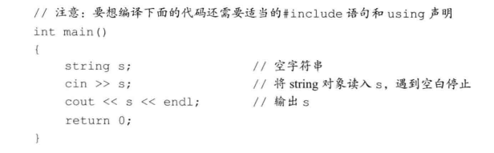
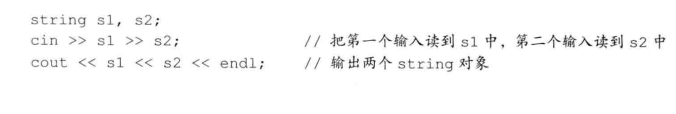

# 第三章 字符串、向量和数组

## 3.1 using声明

通过 using namespace::name 使用命名空间中的成员。

```
// 
using namespace::name
```

**头文件不应包含using声明**

## 3.2 string

**进行cin读取操作时，string对象会自动忽略开头的空白，即空格符、换行符和制表符等，从第一个真正的字符开始读起，直到遇见下一处空白为止。**



如果输入是 “   Hello world   ”，那么输出是“Hello”，没有前面的空格，也没有后面的空格和world



如果连续读取，那么s1是“Hello” s2是“world”

**用 getline 读取来保留输入时的空白符。**

string的size函数返回的是一个 **string::size_type**值，所以**最好使用```auto len = str.size();```来获取string的size**，避免因为混用int 和 unsigned int造成麻烦。

string 的 + 运算符必须保证两侧有一个是string变量 ```string s1 = "Hello" + ",world";```是错误的。 **字符串字面值 与 string 是不同类型。**

string 的下标访问不能越界，否则会产生不可预知的结果，string对象的下标必须大于等于0且小于s.size()。 使用string 的下标之前，要先判断string 是否为空。