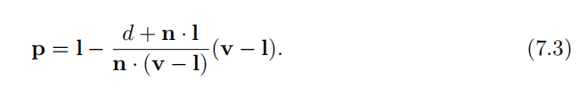
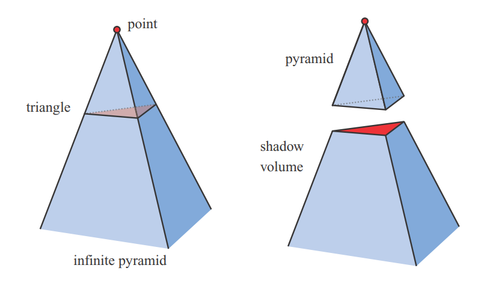

# 概述

计算阴影的基本原理

- 最重要和常用的实时算法
- 一些不常用但是蕴含重要原理的方法

用到的术语：

*occluders* 会投射阴影到 *receivers*上, 

*Punctual light sources* 产生 *hard shadow*,  *area or volume light sources* 产生 *soft shadow*

*umbra* 是阴影中的完全阴影区域， *penumbra* 是阴影中的部分阴影区域

软阴影有模糊的(*fuzzy*) 阴影边缘，但是不能通过对硬阴影的边缘简单的低通滤波来得到软影，因为软阴影的*umbra* 区域的大小 不与由*punctual light source* 产生的硬阴影相关，阴影的软硬程度与 *occluder* - receiver 的距离 和 *light source* 的区域大小有关。

即使阴影形状不准确，那也比没有阴影好得多。

首先介绍 *receiver* 是平面的阴影，然后介绍更通用的阴影算法，将阴影投到任意表面，包括硬软影。同时还会在不同阴影算法中介绍一些优化技巧。

# 平面阴影*Planar Shadows* 

*receiver* 是一个平面，阴影被投射到一个 *Planar surface*

## Projection Matrix

光源$l$, 顶点$v$, 投影点$p$, 左图：投影到 $y=0$ 平面；右图：投影到$\pi:n\cdot x+d=0$ 平面

> $\pi:n\cdot x+d=0$  平面方程 是法向量$n$ + 平面内一点$d = -n\cdot vec(x0,y0, z0)$，

 根据左图：

同理，有, $p_y = 0$

由此可得$p = Mv$ 的变换矩阵 $M$

根据右图，如果*receiver* 是斜平面，那么

$d + n \cdot l$ 是点$l$ 到平面$\pi$ 的距离， $n \cdot(v-l)$ 是$l$ 与 $v$ 点之间的距离 在$n$ 上的投影距离，因此 向量$p - l$ 可以用相似三角形 和 向量$v-l$ 得到

> $d + n \cdot l = n \cdot (l - vec(x_0, y_0, z_0))$

则矩阵M为：

## 绘制流程

得到$projection matrix: M$ 之后，将变换之后的$occluders$ 的顶点 **给其一个 *dark color and no illumination***。同时要避免把$p$ 点 变换到$\pi$ 平面下，可以**给$\pi$ 平面减一个*bias***，更好的方法是：先绘制*ground plane*，然后绘制*projected triangles* 并关闭*z-buffer*保证$p$ 点一定被渲染出来，然后正常渲染其他几何。

如果*plane*不是无限大，则可以： 先绘制*receiver* 到屏幕上面，和**模板缓冲(*stencil buffer*)** 中；然后关闭*z-buffer* 并开启 模板测试，只有当*receiver* 被绘制时才绘制*projected triangles* ，然后正常渲染其他几何。

还有一种**将三角形渲染到纹理，把纹理应用到plane**的算法，这种纹理是一种***light map***，可以调节表面的光照强度，这种算法可以生成阴影的*penumbrae area* 和 投影到曲面表面。缺点是纹理的一个单位会覆盖多个像素，造成失真。另外，如果光源和投射平面，物体之间的相对关系不变化，*light map*可以重用。

该方法必须要保证 光源-遮挡物-平面 之间的顺序，否则会出现错误结果。

上图的光源在遮挡物和平面之间，出现错误结果。

## 软影

*Projective shadow* 也可以做 软影。

由于面光源，所以产生软影。常规想法是在面光源上采样多个理想点光源，再根据采样的点光源渲染出不同的阴影图像，缓存在*buffer* 中，再对所有阴影图像加权平均。理论上可行，但是这样做无法实时。

令一种方法是：把面光源当做viewer，把*receiver plane* 当做相机的远平面，在面光源表面采样 点， 设置fov 足够大，将*occluder* 完全包括，生成一系列的*ground-plane textures*， 对所有的 *textures* 加权平均。该方法太耗时，往往作为其他方法的“ground-truth”

一个效率更高的方案是使用卷积，滤波等对 从一点产生的硬阴影做*blurring*，缺点是在 物体与平面接触的地方也会产生阴影。

# 曲面上的阴影

从平面阴影扩展到曲面阴影的一种简单方法是：使用从光源处当做*viewer* 预先生成的阴影图像，把它当做投影材质，光源可见的地方照亮，不可见的地方则是阴影。然后把材质投射到*receiver* 表面，*receiver*上的每一个顶点都有一对**纹理坐标$(u,v)$**，纹理坐标的值通过**应用程序**明确地计算出来。与上一节中，*occluders* 是投射到一个具体的真实平面上，而这里的阴影图像是**光源相机*light viewer* 产生的逐帧投影**。

渲染时，阴影材质直接修改*receiver*表面，例如，直接给地面上的人物角色一个位于其下方的*drop shadow*；或者假设物体上方有一个长方形光源，产生物体水平方向切片的一系列阴影图像，以*mipmap* 或其他类似*mipmap* 的方式存储起来，通过*mipmap*检索每个切片的对应区域，区域的获取方式与切片区域到阴影接收平面的距离成比例，即越远的切片将投射越软的阴影。

**缺点**：应用程序必须时刻辨别哪些物体是*occluder  receiver*；不能产生自阴影；*light-occluder-receiver* 的相对顺序不能改变。

# 阴影锥 Shadow Volumes

使用模板缓冲*stencil buffer*，而不是基于图像的（比如深度贴图等）。如今不被使用，因为其不可预测的开销，但是原理很重要，值得学习。

*point light* 与 三角形图元的三个顶点形成一个无限金字塔*infinite pyramid*，其中三角形的下方截断金字塔部分被称为*shadow volume*，凡是位于*shadow volume*中的*geometry*都处于阴影中。

那么怎么判断一个物体是否在阴影中呢？从*viewer*处发射一条射线，穿过一个像素，直到射线碰撞到该像素上显示的那个物体为止，在此过程中，射线穿过*shadow volumes*的正面则计数++，穿过背面则计数--，等到射线终止时，如果计数器大于0则物体位于阴影中，否则物体被照亮。

该方法非常耗时，使用模板缓冲改进：首先清空模板缓冲；然后只使用未被照亮材质的颜色值，绘制整个场景到帧缓冲中，为后续得到颜色缓冲中的*shading components*和*z-buffer*中的深度值；第三步，更新*z-buffer*，关闭颜色缓冲的写入操作，继续关闭深度测试，绘制阴影锥的正面三角面（锥的侧面四边形用两个三角形表示），三角面的模板缓冲加1；第四步，开启模板缓冲，这一次绘制阴影锥的背面三角面，其模板缓冲减一。只有不被真实物体遮挡的可见的阴影锥侧面才会进行模板缓冲的加减操作；最后，整个场景再渲染一遍，只有模板缓冲中值为0的像素点才会受到光照影响。

[阴影锥OpenGL具体实现流程与思想](https://wiki.jikexueyuan.com/project/modern-opengl-tutorial/tutorial40.html)

上述方法在物体穿过相机近平面时，会产生计数的错乱。解决方法是*z-fail*，就是不止判断front 和 back 的侧面，还判断阴影锥的上下底面。

这种做法要求从一个三角形面片就要生成四个面（四边形*quadrilaterals  *），计算代价很大。一种策略是 仅仅绘制沿着物体的剪影边缘(*silhouette edges*)的三角形面片，可以使用几何着色器自动生成剪影边缘，还可以应用*culling and clamping*技术降低性能消耗。

**缺点**：不稳定。依赖于相机、光源和遮挡物的位置关系。如果相机在场景中围绕遮挡物移动，移动到遮挡物的阴影锥外面较远位置，计算代价相对较小；如果靠近阴影锥，那么将会有更多的像素需要比较阴影锥；假设移动到了某个阴影锥中，那么所有像素都要走一遍阴影锥的判断流程，这样会造成巨大的不可预测的性能跳变。因此，为了友好的交互性，这种方法由于帧率不稳定已经逐渐不被使用。

改进算法 Per-Triangle Shadow Volumes Using a View-Sample Cluster Hierarchy  

# 阴影贴图技术

*z-buffer*中的每一个像素包含 距离光源最近的物体的深度值，这个*z-buffer*被称为阴影贴图*shadow map*，阴影深度贴图或阴影缓冲。

进行第二遍渲染，使用深度贴图，从*viewer*视角渲染第二遍，如果*rendered point*的深度值与在阴影贴图上的其当前像素的深度值做比较，如果大于阴影贴图的深度值，那么说明该点在阴影中。

阴影贴图使用*texture mapping*技术，构建阴影贴图的代价大致与待渲染的像素数量成线性关系。只要光源与物体不移动的场景，阴影贴图只需要制作一次就可以重复利用。

对于远距离的定向光源（如太阳光），其视角被设定为： 要包括所有*viewer eye*的视锥中的投射阴影的物体。定向光使用正交透视(*orthographic projection  *)，它的视野范围$x,y$ 要设置地足够宽 和 高。如果局部光源距离 阴影投射物体足够远，需要设定一个单独的视锥体去 包围覆盖所有的阴影投射物体。如果局部光源是聚光灯，本来就有其自己的视锥体，只要考虑其视锥之外的东西不被照亮即可。

如果局部光源在可视场景内，且光源周围被*shadow-casters*包围，使用*six-view cube*类似立方体环境贴图，叫做**万向阴影贴图**。万向阴影贴图的挑战是 避免在两面贴图的相交处出现失真*artifacts*，解决方案是提供一个用于全向照明的通用多视锥划分方案*multi-frustum partitioning scheme for omnidirectional lights*，同时在需要的地方提供更高分辨率的深度贴图；还可以 为一个点光源基于每个view投影视锥体的屏幕空间覆盖区域 分别设置六个面的分辨率，所有的map存储在一个纹理集合 *texture atlas*。

并不是场景中的所有物体都需要生成深度贴图：

- 只有能够投射阴影的物体才需要渲染至深度贴图，例如地面只需要接收阴影而不会投射阴影，不需要把地面渲染至深度贴图；

- 根据*eye*确定一个可见的*visible shadow receiver set*，这些*receiver*可以为光源的视锥体确定一个最远距离，超出这个距离的thing不能再投射阴影到eye的可见receiver上面，*visible shadow receiver set*可能远远小于光源的初始$x,y$ 可视范围。左图：光源的视锥体包含eye的视锥体；中间：光源的远平面拉进，仅仅包含了*visible receiver*；右图：光源的视锥体界限被设置为紧贴*visible receiver*，绿色物体被剔除。

  如果光源位于eye 的视锥体内，eye视锥体外的物体都不会投射阴影。

  只渲染相关物体到深度贴图的好处：节省渲染时间；提高阴影贴图精度，可以让光源的视锥体近平面尽可能远离光源。远平面尽可能靠近光源，提高*z-buffer*的有效精度。

  

**缺点**：阴影质量取决于阴影贴图的像素分辨率以及*z-buffer* 的数值精度。 

由于阴影需要深度比较，容易产生走样*aliasing*问题，尤其是在不同物体的相邻 点之间。*self-shadow aliasing*也叫做*shadow acne*，一个三角形错误地关联到自身阴影。原因有两个：处理器的数值精度；几何原因，用一个样本点的值代表了一个区域的深度值，即光源空间的样本几乎与屏幕样本不在同一个位置，当从光源处得到的深度值与相机观察控件的表面深度值比较时，光源的值可能稍微低于表面的深度值，导致*self-shadowing*问题（左图）。

解决方案是引入一个偏移值*bias factor*，偏移值的大小与*receiver*表面和光源的夹角成比例，表面与光源之间月倾斜，偏移值越大。这种偏移值叫*slope scale bias*，在OpenGL中使用 `glPolygonOffset`.*slope scale bias* 通常与*constant bias*一起使用，避免可能出现的精度误差。*slope scale bias* 会被设定一个上界，避免斜率很大时，*bias* 的值过大。左图：没有加bias，叉点表示view视角的像素，圆点表示light视角的shadow map，蓝色和橘色的像素点本来应该被照亮，但是只能与最近的light 点比，被错误地赋予了阴影；中间：是添加了一个常量bias，蓝色的点依然不正确；右图：阴影贴图按照*slope scale bias*整体移动。

***normal offset bias*** : 沿着表面的法线方向稍微移动*receiver*的世界空间*world-space*位置，移动的bias距离与光线方向和几何法向量的夹角 sin值成正比。不仅改变深度z值，而且还包括深度贴图里的样本的x 和 y 坐标，随着光线与表面的夹角变得越来越小*shallow*，偏移逐渐增加，样本在表面上方距离表面足够远，看上去好像 是把样本点 向*receiver*上方移动，形成了一个“virtual surface”。偏移值是一个*world-space distance*。Pesce等人建议沿着相机的观察方向移动bias，调整阴影贴图的坐标。

*light leaks*：物体好像轻微漂浮在平面上，因为bias 的值设置过大，物体与平面接触区域被推得太远因此没有接收到阴影。

*second-depth shadow mapping*：只渲染*backfaces* 到阴影贴图中，适合 **无法手调bias的场景**，比如 具有两个面的物体*two-sided object*，薄物体，或者与其他物体有联系的物体。 *two-sided object*意味着物体 mesh 的两面都可见比如 纸张，树叶等，由于背面和正面在同一个位置，会产生生自阴影。还有像靠近剪影边缘*silhouette edges*或薄物体的地方，也会产生自阴影。加一个bias虽然可以解决，但是又会产生光泄露，好像 *receiver*和 *occluder*的背面 的接触点之间没有分离。采用何种策略应该根据场景确定，如对太阳光产生的阴影使用object 的正面，对室内光源使用背面。

**物体必须是*watertight***的，即多面体和封闭的，或者前和后两个面都被渲染到map里，才能用阴影贴图来生成阴影。[Woo](The Shadow Depth Map Revisited  )提出一种仅使用前和背面的中间层来渲染阴影贴图。通过深度剥离或其他的透明度相关技术，渲染实体物体为阴影贴图，跟踪离光线最近的两个表面，两个物体之间的平均深度形成一个中间层，其深度被用做阴影贴图，这种阴影贴图叫做***dual shadow map***。如果物体足够厚，那么自阴影和光泄露的失真问题就被弱化。

帧间阴影贴图重新生成问题：随着viewer的移动，light 相机也要变化，因为*visible receiver*的集合改变了，导致光源的阴影贴图是一个不同的样本点集合，而且光源的方向变化规则 与前一帧的receiver集合 没有关联。对于定向光，解决方案是强制后续的阴影贴图与世界空间的*texel beam光束 locations* 保持相对一致性。也就是说，阴影贴图相当于是一个整个世界空间的二维参考网格，map上的每一个网格代表一个像素样本。当viewer 移动，阴影贴图 只是对相同的网格 产生了不同的集合，即**光线视角的投影被强制在网格**上，以保持帧间一致性。

## 分辨率增强 Resolution Enhancement

***perspective aliasing* 透视混叠**：viewer 和 light 重合时，阴影贴图和第二遍pass时的像素完美重合，此时当光源变换时阴影贴图中每像素的比例就会变化，造成伪影*artifacts*，如下图所示阴影是块状的，前景中的大量像素与阴影贴图的某一个像素对应关联，这种不匹配叫做透视混叠。

***projective aliasing*** 透视走样：表面对着光线的边缘但是面向观察者，也会导致单张阴影贴图的像素覆盖多个像素，如下左图，光源几乎垂直向下照射，阴影贴图分辨率很低，导致用户视角看到的阴影边缘是模糊的；右图是光源几乎平行照射，每一个阴影贴图像素覆盖更多的屏幕区域，导致锯齿阴影边缘。

改变光源的取样模式，使其更贴合相机的采样模式。左图eye的取样精度并没有和light的生成样本精度匹配，右图中光源的样本生成精度与eye的进行匹配。具体做法是改变场景在光空间的映射方法，通常认为视锥体是关于观察向量对称的，但是观察向量只是定义了一个观察平面，而不决定样本点的选取。视锥体的窗口可以在某个平面上移动，倾斜和旋转，将世界空间以一种不同的形式映射到观察空间。视锥体的四边形仍然以常规间隔采样，因为GPU的原始方法还是线性变换矩阵，但是可以通过变换光源的观察方向和观察窗口的大小来修改采样率。

有22档次的自由度将光源的view 映射到 eye的view。算法有：perspective shadow maps ([PSM](Perspective Shadow Maps  )) , trapezoidal shadow maps ([TSM](Anti-aliasing and Continuity with Trapezoidal Shadow Maps  ))  and light space perspective shadow maps ([LiSPSM](Robust Shadow Mapping with Light-Space Perspective Shadow Maps  )) ，每种方法都可以帮助匹配某些特定情况下的几何和照明情形，而在其他情形下会恶化，各方法各有优缺点。有人做了概述，当光线方向与观察方向垂直时，这些方案的效果最好，因为透视变换可以被平移从而使更多的样本接近相机。

***dueling frusta***：当光源在相机前，并指向相机时，上面的矩阵扭曲*matrix-warping* 技术无法work。在靠近相机的地方需要 更多的阴影贴图样本，但线性扭曲只能使情况更糟糕，因此矩阵扭曲方法不稳定，会造成阴影质量的突然变换和相机移动时的不稳定，使这些方法的应用受限制。

在离相机近的地方增加更多的阴影贴图样本，即针对一个观察视图生成多个不同分辨率的阴影贴图，附近物体有高分辨率，远处的物体分辨率下降。Flagship工作室开发了：一个阴影贴图针对附近的动态物体，另一个针对观察者附近的静态物体的网格部分，第三个针对整个场景中的静态物体。第一张阴影贴图逐帧产生，其他的只需要产生一张因为光源和几何是静态的，针对不同物体和情况的多阴影贴图的想法非常重要，预计算和自适应是算法优化的永恒课题。

**CSM**：级联阴影贴图*cascaded shadow mapping  *。随着深度增加，每个连续的体积大约是前一个体积的两到三倍，分别为不同体积生成阴影贴图，通过使用纹理集合或数组，不同的阴影贴图可以被视为一个大的纹理对象，由此最大限度地减少缓存访问的延迟。*dueling frusta*可以得到很好地解决，通过在eye周围，采样高精度的阴影贴图，并且没有最坏情况来造成质量不稳定。

左图：观察空间被划分为4个视锥体；右图：为四个视锥体创建包围盒，决定方向光的四个阴影贴图渲染视锥体。

在观察空间按照z值 分割时，一种方法是按照对数分割：

$n$ 是整个场景的近平面，$f$ 是远平面，$c$ 是阴影贴图的数量，$r$ 是结果比例。如果$n$ 很小，如 $n$ 是0.1，$f$ 是1000，$n$ 是3  那么第一级阴影贴图仅仅覆盖0.1-2.154的范围，太小了。如果这个区域没有物体，那高精度的阴影贴图反而浪费了。所以可以采用 对数分布 加 等距分布 的加权混合方法。更精确的做法是确定场景的紧密视图边界。

***sample distribution shadow maps* SDSM:** 在交互环境中，合理设置相机的近平面距离很有挑战。可以利用之前帧的深度值估计下一帧的近平面。

- 第一种做法是 通过寻找最小和最大深度值来设置近平面和远平面，具体做法是GPU的还原*reduce* 操作，通过将输出缓冲反馈回去作为输入，直到剩下一个 $1 * 1$的缓冲区，一系列越来越小的缓冲区被计算着色器或其他着色器分析，通常会把数值调小一点来 为场景中物体的移动速度做调整。
- 第二种做法是 做出 深度值的直方分布图，分析深度缓冲中的数值分布，除了可以找到近平面和远平面之外，还可以截取到没有物体存在的深度范围，给级联图带来更高的深度值精度。

实践中，第一种方法更快，结果好，被广泛采用。

**shimmering artifacts  闪烁伪影**：由于光照样本在帧间移动产生闪烁伪影，尤其是级联贴图边界处的物体在边界来回移动时，情况更糟糕。一种方案是：让级联的视锥体重叠一部分，边界处的阴影采用重叠区域的样本混合。还可以：使用*dithering*抖动 技术在边界区域采集单个样本。

如果阴影贴图的视锥体里面没有东西改变，那么阴影贴图不需要重新计算。对每一个光源来说，投影物体可以通过搜寻哪些物体对光源是可见的以及这些物体中的哪些可以投射阴影到*receiver*上而 被预计算。由于无法感知阴影是否正确，可以使用：一个低分辨率的模型来近似投放阴影；或者考虑移除微小的遮挡物，理论上远处的阴影贴图不怎么重要，可以多帧更新一次，但是这样做会导致大型移动物体的伪影出现，要慎重使用该方法。

[Day](CSM Scrolling: An Acceleration Technique for the Rendering of Cascaded Shadow Maps  )提出一种帧间的 *scrolling distant maps*技术，静态深度贴图的绝大部分都可以帧间复用，只有边缘会变化需要重新渲染。《DOOM》游戏维护了一个大型的阴影贴图集合，只在物体移动的地方重新生成阴影贴图，更远的级联贴图被设置为完全忽略动态物体。对于某些场景，使用高分辨率的静态阴影贴图代替更远处的级联贴图，大大减少计算量。

稀疏纹理系统被用于 单一的巨量静态阴影贴图的世界，级联阴影贴图可以和*baked-in light-up* 烘焙光影 的纹理或其他适合特定场景的阴影计算方法结合使用。

[Valient](Shadows + Games: Practical Considerations  ) 提出了针对不同的游戏的不同阴影系统的定制技术。

创建阴影贴图集合可以使用几何着色器复制物体数据并将物体数据发送到多个视图，最多允许将一个物体输出到32个深度贴图，多视口扩展可以将一个物体渲染到特定的纹理序列片上，缺点是所有生成阴影贴图的遮挡物必须被送到管线。

[Bittner](Shadow Caster Culling for Efficient Shadow Mapping  )使用遮挡剔除，从相机中找到所有的可见的阴影接受者，然后从光源视角，渲染所有的潜在的阴影接受者到模板缓冲的mask 中，模板缓冲的mask 编码了所有从光源处看到的可见阴影接收者，使用*occlusion culling*遮挡剔除 从光源下渲染物体，使用掩码剔除没有接收者的物体。由于光源的辐射度随距离的平方衰减，可以在一定阈值之后剔除光源。

# PCF  Percentage-Closer Filtering

扩展阴影贴图的样本选取可以生成 伪软阴影*pseudo-soft shadow*，也可以缓解阴影贴图分辨率过低导致一个阴影贴图样本覆盖多个屏幕像素所产生的块状阴影问题。

PCF：从阴影贴图中检索多个样本然后混合结果。采用类似纹理增强技术*texture magnification*，表面的深度分别与四个样本的深度比较，确定每个样本点的值是0或1，0表示处于阴影中，1表示被照亮。然后对每个样本点的结果进行双线性插值来计算光源对表面的实际贡献。这种过滤的结果是人造软影，*penumbrae*半影的变化取决于阴影贴图分辨率，相机位置和其他因素，例如更高的分辨率使边缘的软化更窄。不管怎么说，一个小的半影和平滑好过没有。

区域光源产生软影。到达平面上一个点的光线数量 与 从该点处看过去的区域光源 可见比例 有一个函数关系。

左图：棕色线展示了 半影*penumbrae*区域的形成原理。对于*receiver*上的点$p$ 来说，接收到的光线可以通过 测试区域光源上的点不被任何遮挡物阻碍 来计算得到。右图：点光源无法产生半影区域。PCF的做法是 将半影产生过程逆过来从而近似实现半影：对于一个给定的点，让其在阴影贴图上采样一个可计算区域的所有样本，然后减去被照亮的那部分样本，得到阴影比例。红色椭圆表示阴影贴图上的采样区域。 可计算区域的采样半径是与 接受者和遮挡物的距离 成比例的。

为了避免*aliasing artifacts*走样失真，需要确定：采样半径多大？使用多少采样点？采样模式？如何对结果加权？

采样过程可以采用一种特殊的纹理采样技术来加速，类似双线性插值*bilinear interpolation*，通过获取四个邻近位置，对四个样本点与给定的值做比较，返回通过测试的比例 而不是对结果直接进行混合。缺点是：在一个规整的网格模式下采样邻近样本点可能导致明显失真，可以使用一个联合双边滤波器，模糊结果的同时保留物体边缘，可以提高阴影质量同时避免阴影泄露到其他表面。

不同的采样模式：左图是在一个4*4的网格模式下进行PCF采样，使用最近的样本点。右图是一个12-tap的泊松采样盘，使用这个预先计算的泊松分布采样模式对一个区域进行采样的结果是左图中，依然存在失真现象；左图右，采样模式是 围绕采样中心随机旋转分布采样，失真基本被解决，但是带来了噪点。[Casta˜no  ](Shadow Mapping Summary—Part 1  )提出了一种基于双线性采样的高效高斯加权采样方案。

PCF会导致自阴影和光泄露问题更加严重，因为 根据斜率来比例缩放bias值 需要有一个假设：样本在阴影图上的偏移距离不超过1个纹素(*texel*)，而PCF是要在样本的周围采样，测试样本可能会被实际的表面挡住。[Burley](Shadow Map Bias Cone and Improved Soft Shadows: Disney Bonus Section)提出了 *bias cone*，在*bias cone*中，每个样本向光源方向移动，移动距离与原始样本-光源的距离成比例，他还建议了一个 2.0的斜率值和一个恒定的bias值。如左图所示，中间的样本点是原始样本，其两边的样本都是扩大采样后的测试样本，测试样本根据*bias cone*偏移锥移动。还有类似中间图，测试样本利用receiver 本身的斜率移动，并考虑使z值以非线性的方式变化，*receiver plane depth bias*假定附近样本的位置位于三角形的同一平面；右图是 沿着表面的法线方向，按照法线与光线的角度sin值成比例移动。	以上的方法不仅影响了深度，而且改变了阴影贴图测试时的纹理坐标。

PCF缺点是 采样半径是恒定的，阴影的软都是均匀的软，当遮挡物和接收物之间有地面相接触时，结果就不正确。

# PCSS Percentage-Closer Soft Shadows

在阴影贴图上搜寻邻近区域来找到所有可能的遮挡物，遮挡物与样本点的平均距离 决定采样区域的半径：
$$
\omega_{sample} = \omega_{light} \frac{d_r-d_o}{d_r}
$$

$d_r$ ： *receiver*和光源之间的距离	$d_o$：遮挡物的平均距离

遮挡物离光源越近，对光源的遮挡越多，采样半径应该越大。对于不太重要的远处的软阴影，使用较低采样率。

缺点是需要对阴影贴图的一个相当大的区域进行采样来寻找遮挡物，可以使用旋转泊松圆盘采样来解决采样不足的问题。[Jimenez   ](Next Generation Post Processing in Call of Duty Advanced Warfare  )指出泊松采样在用户移动过程中是不稳定的，并且通过使用 一种介于抖动和随机之间的函数 形成的螺旋式采样模式 可以得到更好的帧间效果。

[Sikachev](Next-Generation Rendering in Thief  )介绍了一种**接触硬化阴影*CHS***技术，更快实现PCSS，避免采样核半径受阴影贴图的分辨率的影响。首先生成阴影贴图的*mipmap*，然后选择最接近用户在世界空间中自定义的采样核半径 的mip级别，现在只需要一个 8*8 的采样区域就可以得到平均遮挡距离，只需要16个`GatherRed()`纹理调用。一旦得到半影估计，阴影的sharp区域就可以使用更高分辨率的mip级别，更软的区域使用低分辨率的mip级别。

*separable soft shadow mapping SSSM* 分离网格的取样过程，尽可能重复利用纹素和像素之间的取样。

***min/max shadow map *** 分层加速，快速决定样本点是完全处于阴影还是完全被照亮。虽然阴影贴图的深度不能被平均化，但是可以用mipmap保存深度值的最小和最大值，给定一个纹素位置，深度值，和采样区域，如果纹素的深度值比最大深度值还要大，那么当前纹素必定处于阴影中，不需要再针对当前这个纹素做测试采样了。

***backprojection GPU***：反投影。PCSS是基于平均遮挡距离会影响半影区的大小的假设，举例一种情况：一盏路灯和一座远处的山，物体的一部分 遮挡同一个像素时就会打破这种假设，出现伪影。该方法是将每个receiver的位置当做一个视点，把区域光源当作视图平面的一部分，并把遮挡物投影到区域光源这个平面上，计算遮挡比例。还可以采用*depth peeling*深度剥离技术来创建一个多级阴影贴图。这种方法成本过高，不能用于交互式应用。

# Filtered Shadow Map

存储两张map：深度值和深度值的平方。这些贴图可以被模糊，mipmap，和放在总和区域表中，可以由MSAA或其他反走样算法生成。将阴影贴图视为**可过滤纹理**。

可过滤的阴影贴图优势是 在从map中获取数据时 可以使用 整个的 采样和过滤技术 的阵列。

***variance shadow map (VSM)***：**方差阴影贴图**。在深度贴图的*receiver*处采样一次得到一个最近遮挡物的平均深度，如果这个平均深度$M_1$被称为*first moment*，大于*receiver*的深度$t$，那么*receiver*完全处于光照中；如果小于，则使用公式判断：
$$
p_{max}(t) = \frac{\sigma^2}{\sigma^2+(t-M_1)^2}
$$
其中$p_{max}$ 是处于光照中的样本比例的最大值，是一个上界，实际的照度比例不能大于$p_{max}$，根据切比雪夫不等式，在表面某位置的遮挡物分布中，有多大比例会超出receiver到光源的距离，对于固定深度的平面平面遮挡物和平面接收物，可以把$p$近似为$p_{max}$，因此公式2是对大多数场景的近似； $\sigma^2$是一个方差，$t$ 是receiver的深度，$M_1$ 是阴影贴图中的平均期望深度。深度值平方的阴影贴图中的样本为$M_2$，被称为*second moment*，被用来计算：
$$
\sigma^2 = M_2 - M_1^2
$$
[Myers  ](Texture Space Caching and Reconstruction for Ray Tracing  ) 指出 方差在阴影边缘会变大，深度变化越大，方差越大，$(t-M_1)^2$ 对于可见性比例 是一个决定性因素，这个值略高于零表示平均遮挡物的深度比接收物略靠近光线，$p_{max}$就接近1，全亮，这将发生在半影区的全亮边缘。进入半影区后，平均遮挡物的深度越来越接近光线，这个值变小，p值下降。同时半影区的方差从边缘的几乎为0，到遮挡物深度变得不同和 等分区域，这个公式使整个半影区呈现线性变化。

**VSM**能够以一种较好的方式处理bias问题，[Lauritzen](Summed-Area Variance Shadow Maps  )给出了 关于斜率修改$M_2$ 的 推导。VSM的问题在于公式3放大了深度值的数值精度带来的问题，因为公式3加了平方，可以使用高精度浮点型的纹理来避免精度问题。VSM使用了GPU的纹理优化能力来提高效率，VSM仅仅需要一次高质量的采样就决定整个区域的效果，并且产生了平滑的半影区域。这意味着可以在算法限制下，不增加成本的情况下使阴影变得任意柔和起来。

下图：光源距离越来越远，阴影效果如下图。

VSM会产生**漏光**问题：如果receiver与光源之间有多个遮挡物，由于VSM只采取最近遮挡物的平均深度，可能造成：实际上receiver是处于阴影中，但是却被计算出来处于半影区，即漏光现象。解决方法是在更小的区域采更多的样本，即把VSM转化为了PCF的形式。[Lauritzen](Summed-Area Variance Shadow Maps  )还给出了使用*summed-area table*来实现更好阴影效果的方案，以及使用艺术家控制策略将低百分比$p_{max}$视为完全阴影，再把剩余部分重新映射到0-100%的范围，该方法的代价是缩小了半影区。VSM在生成**地形阴影**上效果很好，因为这种场景下的阴影很少涉及多遮挡物。

左图中的茶壶阴影出现了漏光。

*convolution shadow map 卷积阴影贴图*：为了解决漏光问题提出的，将阴影深度编码到一个傅里叶扩展中，收敛到正确解，从而解决漏光。缺点是：需要计算复杂的公式，增加执行和存储代价。

*exponential shadow map  ESM	指数阴影贴图*：存储深度值的指数和其*second moment*到两个缓冲中，因为指数函数更接近阴影贴图形成时的阶梯函数，该方法还避免了*convolution shadow map *的在特定深度处轻微漏光的问题。限制是 *second moment*将变得非常大，浮点数会超过范围，为了提高精度，可以允许指数函数快速陡峭地下降，生成线性的z深度值。

**ESM**比VSM质量更高，比卷积阴影贴图存储代价更小，所以引起了很大兴趣。有很多人针对ESM提出了很多改进措施。

CSM级联阴影贴图技术可以应用于过滤贴图开提高精度，**cascaded ESM**可以为所有级联设置一个偏置系数。

# Volumetric Shadow Techniques 体积阴影技术

渲染**透明物体**的阴影，如云，烟雾，头发等的阴影，这些对象要么是微小的，要么是半透明的，无法使用单一深度贴图来生成阴影。

透明物体会使光源衰减或改变光的颜色，可以使用透明渲染等来模拟这种效果，例如多生成一种阴影贴图，存储透明对象的最近深度值、颜色值或alpha覆盖率等数值，如果*receiver*没有被不透明的阴影贴图遮挡，那么就使用**透明深度贴图**来判断阴影，如果被透明深度贴图遮挡，则检索颜色值或alpha覆盖范围。这种方法无法  投射到那些 处于光源和透明物体之间的*receiver*， 所以不能用来 透明物体自己产生阴影。  仅考虑透明物体作为*occluders*。

[Lokovic](Deep Shadow Maps)首先提出***deep shadow map***的概念，每一个深度贴图的纹素都存储了一个描述光源如何随深度衰减的函数，这个函数由不同深度上的一系列样本点来近似，每一个样本点有一个不透明度的值。阴影贴图中包含特定位置深度的两个样本被用来 找到阴影效果。难点是在GPU上生成和评估这些随深度的光线衰减函数，以及如何存储那些能高度还原这些函数的 数据。***opacity shadow map*** 仅存储 在一系列固定深度下生成的不透明度，这是第一个基于GPU的方法。然而，深度切片都是平行且均匀的，很多切片都需要 隐藏 由于线性插值在 *in-between slice* 切片间的不透明伪影，可以创建更贴近模型形状的不透明贴图提高效率和质量。

***adaptive volumetric shadow maps***：自适应的体积阴影贴图，解决了固定切片，每个阴影贴图上的纹素存储了 不透明度和层级的深度，通过像素着色器在光栅化时 对数据流（表面透明度）进行有损压缩从而不需要巨量内存空间去收集所有样本，并且能够在一个集合中处理数据流。这个技术类似于*deep shadow map*，但压缩步骤是在像素着色器实时完成的。将深度-光源衰减函数限制在一个小的固定数量的可存储的 不透明度/深度对，使GPU上的压缩和检索更高效。由于需要读取更新曲线，所以需要硬件支持**UAV ROV**，代价也比混合更高。

[F¨urst  ](Real-Time Deep Shadow Maps  )给出了针对游戏实现的*deep shadow map*代码，使用链表存储深度和alpha值，使用指数阴影映射来提供照明和阴影区域之间的柔和过渡。

[Selgrad](Cinematic Color: From Your Monitor to the Big Screen  ) 使用链表存储多个透明样本，使用分散写入的 计算着色器来构建阴影贴图，他们的工作使用了 *deep shadow map*的概念，以及*filtered map*和其他元素，提供了一个更普遍的高质量软影解决方案。

# Irregular Z-Buffer Shadows

阴影贴图方法的成本可以预测，能适应不断增加的场景，**最坏的情况是与 面片的数量成线性相关**，阴影贴图可以通过光栅化很好映射到GPU上。缺点是眼睛看到的位置与光空间的贴图位置不是一对一的映射，当光线对一个表面的采样频率低于眼睛时，就会出现样本点的**混叠问题**，即使采样率相当，也会出现偏差问题，不可避免。

阴影锥提供了一个精确解决方案，定义了所有位置是否被照亮/处于阴影中，但是成本太不稳定。

光线追踪也能准确产生阴影，从接收物的位置向光源发射射线，如果发现有物体挡住了射线，证明接收物处于阴影之中。快速光追的代码都在生成和使用分层数据结构，来尽量减少每条光线所需的物体测试数量，为动态场景的每一帧建立和更新分层结构一直在探究。

通过GPU的光栅化硬件去观察场景。在每个光线的网格单元中存储遮挡物的边缘信息和深度值，比如在阴影贴图的每一个纹素都有一系列的与网格重叠的 三角形列表，这个列表可以由 *conservative rasterization* 保守光栅化来产生，如果一个三角形的任何部分与一个像素而不仅仅是像素中心点重合，那么就会产生一个片段。问题是每个纹素的数据量不能过大，所以在每个接收物位置的状态在确定时将不准确，除了物理内存受限，GPU面对存储不同数据量的像素列表时也会变得低效。

***irregular z-buffer  IZB*不规则的深度缓冲区**：不是缓冲区不规则，缓冲区本身是一个正常的有规律的阴影贴图的形状，缓冲区中的内容可以不规则。在阴影贴图中存储三角形或其他数据并且根据三角形测试接收物的位置 与 存储接收物位置并且测试每个位置的三角形 是一个反转问题。缓冲区中的每个纹素 将有一个或多个接收物的位置，也可能根本没有。阴影贴图不再仅仅存放规律的深度值，而是像下图中一样，阴影贴图的每一个纹素都存放一个列表。通过保守光栅化进行阴影测试。

通过多通道算法创建IZB，测试IZB中的内容对于光源的可见性。做法是：先从相机渲染场景，找到从相机看到的表面的深度值，这些点被转换到光源视角下，并从光源的视锥体中形成紧的边界；然后，将这些点存储到光源的IZB中，每个点都放置在对应纹素的列表中，有些列表可能是空的。遮挡物被保守栅格化到光源的IZB中来确保是否存在任何隐藏的点，因此有隐藏说明在阴影中。保守栅格化能够保证及时三角形没有覆盖到光源 像素的中心，它也可以被测试到可能覆盖的点。

***frustum tracing*视锥追踪：**在像素着色器中进行可见性测试，类似光线追踪的思路：从图像一点的位置到光源产生一条射线，如果一个点在三角形内并且比三角平面更远，那么这个点在阴影中。一旦所有遮挡物都被光栅化，那么能看见光的部分就会被用来进行表面着色。

优化：剔除法线远离光照方向的图像点，避免为空的纹素生成片段，改进GPU数据结构，努力使每个纹素点的长度相近的短列表等，理想情况是每一个列表都有一个图像点。

游戏中常用的方法：通过遮挡物的距离来确定何时使用IZB和PCSS，当遮挡物比较近的时候用IZB生成硬阴影，而遮挡物比较远的时候用PCSS生成软影。阴影质量通常对近处物体更重要，因此IZB仅仅被用于特定物体集合，来降低开销。

# 其他应用

将阴影贴图定义为一个空间的视锥，将明暗分开，来决定物体的哪些部分处于阴影中。渲染可见区域的阴影贴图，计算每一个区域被遮挡的最大高度，检查每个地形高度场的位置能否看见太阳，如果在阴影中，太阳首次可见高度是通过增加固定步长的世界高度一步一步来搜索的，直到太阳进入视野，然后进行二分查找精准的最大高度值。沿着一条垂直线迭代缩小它与阴影图表面相交的位置，将明暗分开，插值得到邻近高度来找到所有位置的最大遮挡高度。

> In other words, we march along a vertical line and iterate to narrow down the location where it intersects the shadow map’s surface that separates light from dark. Neighboring heights are interpolated to find this occlusion height at any location.   

==*screen-space shadows*屏幕空间阴影==：受限于阴影贴图的分辨率，在一些小的特征点 难以获得精确的遮挡关系，比如人脸，我们尤其在意人脸上的任何失真。虽然提高阴影贴图分辨率和只针对特定感兴趣部分渲染会有帮助，另一种方法是 **利用已经存在的数据**。可以利用 **预处理时的相机视角的深度缓冲**，将此深度缓冲当做一种高度场*height*field，对此深度缓冲迭代采样来执行一个射线匹配过程，然后检测朝向光源的方向是否被遮挡。虽然对深度缓冲重复采样了，有很高的成本，但是可以为分割场景中的特写*closeup*提供高质量结果。这个方法被广泛应用在游戏引擎中。

**总结：**

- 某种形式上来说，阴影贴图是迄今为止用于投射到任意表面形状的阴影最常用的方法。

- CSM用于阴影投射在大面积区域时，如户外场景，提高采样质量。
- SDSM为近平面找到一个好的最大距离可以进一步提高阴影贴图的精度。
- PCF生成伪软影，PCSS及其变体实现接触点硬化*contact hardening*；
- IZB *irregular z-buffer*提供精确的硬阴影；
- 滤阴影贴图*filtered shadow map*提供快速软影计算，当遮挡物远离接收物时，效果特别好，比如地形阴影。
- 屏幕空间阴影技术可以获得额外的精度，尽管代价很大。

每个技术都有自己的优势，选择哪种技术取决于 场景大小、场景构成（静态or动态动画）、材料类型（不透明、透明、毛发或烟雾）、灯光的数量和类型（静态或动态；局部或远处；点、面光源等）、底层纹理隐藏伪影等。GPU发展，希望更好地映射硬件算法出现，比如稀疏纹理技术已经被用于阴影贴图的存储，来提高分辨率。

[K¨ampe  ](Compact Precomputed Voxelized Shadows  ) 将光源的一个二维的阴影贴图转化为一组三维的体素（小盒子的想法 第十三章第十节），使用体素好处是体素可以被归类为照明or阴影，因此需要最小的存储代价，可以使用高度压缩的**稀疏体素八叉树表示法** 来存储大量的灯光和静态遮挡物的阴影，

# Further渲染和资源

[Eisemann]()的书籍《Real-Time Shadows》介绍了实时交互的阴影算法，讨论各种算法的优点和成本

[Woo]的书籍《Shadow Algorithms Data Miner》介绍了交互式和批量渲染的广泛阴影算法概述。

[Tuft](Common Techniques to Improve Shadow Depth Maps ; Cascaded Shadow Maps) 对常用的阴影映射技术和所涉及的问题做了很好的概述。

[Bjørge](Moving Mobile Graphics) 介绍了适合移动设备的流行阴影算法，比较各种算法的图像。

[Lilley](Shadows and Cesium Implementation  ) 重点介绍了GIS地形系统渲染。

[Pettineo  ](A Sampling of Shadow Techniques  ) [Casta˜no  ](Shadow Mapping Summary—Part 1  ) 给出了代码，实用技巧和演示。

[Scherzer  ](A Survey of Real-Time Hard Shadow Mapping Methods  ) 专门关注硬阴影的工作总结。

