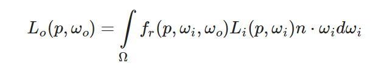
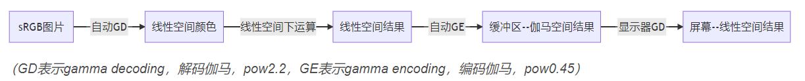
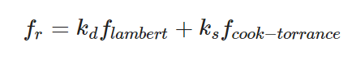
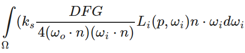

## 自我介绍

面试官您好，我本科毕业于中南大学计算机学院，目前就读于北航vr国重。我的主要研究方向是VR和图形学，有两次项目经历。其一是基于凝视点的光子映射渲染，其二是使用Unity和SteamVR插件开发了一套在虚拟现实中使用标签引导来辅助用户快速搜索物体的系统  。其中第一个项目我们根据凝视点理论，提出了从相机和光源向场景中双向发射光子的算法，使中心视觉区域的光子密度更大。我的主要工作是使用OpenGL搭建具有动态物体和镜面、玻璃等复杂材质的实验场景，比较了PCSS软影和IBL间接光照与我们算法的效果，我还构建了BVH树用来生成光子发射的投影图，优化光子的利用率。第二个项目中，我设计并实现了标签的圆环布局算法和标签引导轨迹优化算法，将锚点物体的方向信息编码到标签的屏幕位置上；我开展了与ground truth对比的模拟实验和一系列用户实验，来评估系统效能。我的编程技能为c++和c sharp，熟悉OpenGL和GLSL shader编写，会使用Unity开发，了解UE4。我能够熟练阅读图形学相关的技术文档，团队协作能力较强，工作积极主动，喜欢推导一些图形学的公式。我非常期待与您的进一步交流，谢谢。

项目过程中最有成就感的事情：独立完成自己的研究工作，包括代码编写，系统测试，设计用户实验到撰写论文，投稿，录制demo。

最难的地方：图形学入门时候的shader编写，既要理解渲染管线，储备理论知识，又要动手写代码，而且glsl的debug没有好用的工具，都要自己摸索。不过万事开头难，在自己用OpenGL完整实现了从场景创建类，模型加载类，相机类，shader类等框架的搭建和一个基本的IBL光照效果的渲染实现之后，再上手光子映射的项目就变得熟练了起来。

# 数学

### 积分

多元函数全微分

非线性问题怎么转换为线性问题


#### 积分怎么离散化求和

可以通过**黎曼和**求解，比如计算渲染方程中半球积分的伪代码：



在半球区域内将渲染方程按照一定的步长`step`分散求解，然后再按照步长大小将所得结果求平均，通过增加离散部分的数量来提高黎曼和的准确度。

```c++
int steps = 100;
float sum = 0.0f;
vec3 P    = ...;
vec3 Wo   = ...;
vec3 N    = ...;
float dW  = 1.0f / steps;
for(int i = 0; i < steps; ++i) 
{
    vec3 Wi = getNextIncomingLightDir(i);
    sum += Fr(p, Wi, Wo) * L(p, Wi) * dot(N, Wi) * dW;
}
```


泰勒公式的作用

傅里叶变换的作用

函数求极值，极值的充分必要条件

### 渲染

定点集求凸包

半球积分的计算

#### 球谐函数

辐射率微分

#### 半程向量

半程向量是入射光线的方向向量与观察方向向量的中间向量。

在计算镜面反射时，传统的phong模型直接使用出射光线的方向向量与观察方向向量求cos值，当两个向量的夹角大于90度时，会出现计算错误的问题，为了让该计算过程更加便利，引入半程向量。直接使用半程向量与出射方向向量的点乘作为cos值，从而避免了cos为负数的情况。


#### 入射向量和法线向量求出射向量

先得到入射向量$\vec{l}$ 和法线向量$\vec{n}$ 的夹角$\theta$，再分别得到入射向量$\vec{l}$ 在法线向量$\vec{n}$ 上的投影向量 $\vec{l} cos\theta$ 和 $\vec{l}sin\theta$，$\vec{l}cos\theta-\vec{l}sin\theta$ 即为出射向量

齐次坐标

### 图形

点在矩形内

#### 点在三角形内

- 光线与三角形所在面的交点是否落在三角形内
- MT算法，根据重力坐标系，三角形内的一点$O$, 满足$O = \alpha A + \beta B + \gamma C , \alpha + \beta + \gamma = 1$, 光线可以表示为$L = LightPos + t*Direction, t为长度$，假设有交点，则有$(1 - \beta - \gamma  )A + \beta B + \gamma C = LightPos + t*Direction$, 三个未知数，同时根据xyz分别相等列出三个等式，根据克拉默法则，可以得到三个未知数的值，如果三个未知数满足$0<\alpha, \beta,  \gamma <1,t>0$, 则相交。

#### 射线与球体相交

#### 球体与面相交

进行点光源的视锥体剔除。

判断圆心与面的距离是否大于半径即可。

#### 射线与AABB相交

把AABB展开为井字，判断射线与井字的交点是否是xxyy还是说xyyx，如果是xyyx则射线与aabb相交

BVH如何加速

圆和矩形相交怎么判断

极坐标球面，给定两点，求两点弧长

### 矩阵

#### 平移旋转缩放矩阵的公式

旋转矩阵：旋转轴$n$只用一个向量$(n_x,n_y,n_z)$表示，默认该向量经过物体的中心。

旋转公式：$x\prime = R(n, \alpha)x$ 。其中$x$是一个向量，表示3D中的一个点， $I$ 是三阶单位矩阵， $nn^T$ 是张量积可以得到一个三阶矩阵

$$
R(n,\alpha) = cos(\alpha)I+(1-cos(\alpha))nn^T+sin(\alpha)\begin{pmatrix}0&-n_z&n_y\\n_z&0&-n_x\\-n_y&n_x&0\end{pmatrix}
$$
绕坐标轴顺时针旋转

$R_x(\alpha) = \begin{pmatrix} 1&0&0&0\\0&cos\alpha&-sin\alpha&0\\0&sin\alpha&cos\alpha&0\\0&0&0&1\end{pmatrix}\begin{pmatrix}x\\y\\z\\w\end{pmatrix}$

$R_y(\alpha) = \begin{pmatrix} cos\alpha&0&sin\alpha&0\\0&1&0&0\\-sin\alpha&0&cos\alpha&0\\0&0&0&1\end{pmatrix}\begin{pmatrix}x\\y\\z\\w\end{pmatrix}$

$R_z(\alpha) = \begin{pmatrix} cos\alpha&-sin\alpha&0&0\\sin\alpha&cos\alpha&0&0\\0&0&1&0\\0&0&0&1\end{pmatrix}\begin{pmatrix}x\\y\\z\\w\end{pmatrix}$

#### MVP矩阵分别是什么

模型矩阵包含平移缩放旋转，变换物体到全局的世界空间；

观察矩阵

#### 如何得到view矩阵

相机在世界空间的position $\vec{e}$, 相机的朝向gaze direction $\vec{g}$, 人为设定的up direction $\vec{t}$（一般是(0, 1, 0)）  这三个向量能完全确定相机的拍摄画面，相机的位置，相机的朝向，相机的旋转角度

位置$\vec{e}$ **移动**到 坐标原点， $\vec{g}$ **旋转**到$-Z$，$\vec{t}$**旋转**到$Y$，$\vec{g}\times\vec{t}$自然移动到$X。

#### 透视除法的意义

将xyz变量除以齐次坐标的w分量，从而将透视投影/正交投影得到的投影空间的坐标转换到标准设备坐标空间中。透视除法会在顶点着色器的最后被自动执行。

#### 法线矩阵

#### 非均匀缩放

如果在顶点着色器中顶点从局部模型空间变换到世界空间的M矩阵没有涉及非均匀缩放

OpenGL 在 *gl_NormalMatrix* 

正交矩阵，特征值，特征向量

旋转矩阵的特征值 

#### 四元数

**旋转矩阵的差值并不能反映旋转角度的差值，因此提出四元数**。25度的旋转矩阵减去15度的旋转矩阵并不能得到20度的旋转矩阵。


#### 欧拉角

俯仰角，偏航角和滚转角即物体分别绕自身三个轴向的旋转角，物体的任何一个旋转都可以分解为分别绕三个轴的旋转，但是分解方式不唯一

#### 万向锁

在俯仰角是90度的时候，滚转角和偏航角的轴重合了，导致失去了一个空间自由度。

#### NDC是什么

透视除法之后得到的标准化设备坐标空间。-1，1的立方体坐标空间。

矩阵SVD分解

# 渲染

## OpenGL

### 核心模式与立即渲染模式

早期的OpenGL使用 立即渲染模式，也就是固定渲染管线，OpenGL大多数功能都被库隐藏起来，开发者不能自由控制OpenGL计算。立即渲染模式容易使用和理解，但是效率太低。

从3.2开始，OpenGL使用核心模式。显卡公司的新特性或者渲染的优化会以扩展的方式在驱动中实现，OpenGL支持这些扩展，而不需要重新修改OpenGL规范

### 状态机

OpenGL自身是一个巨大的状态机：一系列的变量描述OpenGL此刻应该如何运行，OpenGL的状态通常被称为OpenGL上下文，使用如下操作更改OpenGL状态：设置选项，操作缓冲。最后使用当前OpenGL上下文来渲染。

比如 我们通过改变一些上下文变量来改变OpenGL状态，从而告诉OpenGL如何绘图，一旦改变了OpenGL的状态为绘制线段，下一个绘制命令就会画出线段而不是三角形。

通过**状态设置函数**改变上下文，以及**状态使用函数**根据当前OpenGL的状态执行一些操作。

### 对象

OpenGL中的一个对象是代表OpenGL状态的一个子集，是一些选项的集合，比如 OpenGL绘制窗口的设置可以用一个对象来表示：

```c
struct object_name{
    float option1;
    int option2;
    char[] name;
}
```

把OpenGL的上下文看做一个大结构体，对象使用起来就像：

```c
struct OpenGL_Context{
    ...
    object* object_Window_Target;
    ...
}
```

```c
// 下面这段代码展示OpenGL的工作流
// 创建对象
unsigned int objectId = 0;
glGenObject(1, &objectId);
// 绑定对象到上下文
glBindObject(GL_Window_Target, objectId);
// 设置 绑定到GL_Window_Target 对象的一些选项
glSetObjectOption(GL_Window_Target, GL_OPTION_WINDOW_WIDTH, 800);
glSetObjectOption(GL_WINDOW_TARGET, GL_OPTION_WINDOW_HEIGHT, 600);
// 将上下文对象设置回默认
glBindObject(GL_WINDOW_TARGET, 0);
```

首先创建一个对象，并用一个id保存它的引用，实际数据存储在后台。然后将对象绑定到上下文的目标位置。接下来设置窗口选项。最后将目标位置的对象id设回0，解绑这个对象。

### GLSL

着色器的开头声明版本，然后是输入和输出变量、uniform和main函数

数据类型：

- C语言中的默认基础数据类型如`int`, `float`, `double`, `bool`, `uint`等
- 向量类型：`vecn` 默认是float类型的n维向量 还有诸如`bvecn` `ivecn`等
- 输入输出类型：`in`  `out`关键字实现着色器之间的数据交流和传递。发送方着色器声明一个输出，接收方着色器声明一个输入，当类型和名字完全相同时，OpenGL会把两个变量链接到一起，它们之间就可以发送数据了。
  - 顶点着色器应该接收一种特殊形式的输入，需要使用`layout`这个元数据指定输入变量，这样才可以在CPU上配置顶点属性。顶点着色器需要为它的输入提供一个额外的`layout`标识，这样才可以链接到顶点数据。
  - 片段着色器需要一个`vec4`的颜色输出变量。
- Uniform：从CPU向GPU的着色器发送数据。Uniform与顶点属性不同，Uniform是全局的，必须在每个着色器对象中都是独一无二的，并且可以被任意的着色器程序的任意阶段访问。Uniform会一直保存其数据，直到它被重置或更新。
  - 如果声明了一个uniform变量，却从未在着色器中使用，那么编译器会默认移除该uniform变量

### 片段插值

先运行一段 绘制三角形顶点 的代码，三个顶点的颜色分别为 红绿蓝，最后绘制到屏幕上的颜色是

CPU端：

```c++
float vertices[] = {
    // 位置              // 颜色
     0.5f, -0.5f, 0.0f,  1.0f, 0.0f, 0.0f,   // 右下
    -0.5f, -0.5f, 0.0f,  0.0f, 1.0f, 0.0f,   // 左下
     0.0f,  0.5f, 0.0f,  0.0f, 0.0f, 1.0f    // 顶部
};
// 位置属性
glVertexAttribPointer(0, 3, GL_FLOAT, GL_FALSE, 6 * sizeof(float), (void*)0);
glEnableVertexAttribArray(0);
// 颜色属性
glVertexAttribPointer(1, 3, GL_FLOAT, GL_FALSE, 6 * sizeof(float), (void*)(3* sizeof(float)));
glEnableVertexAttribArray(1);
```

顶点着色器：

```glsl
#version 330 core
layout(location = 0) in vec3 aPos;	// 位置变量的属性值为 0
layout(location = 1) in vec3 aColor;	// 颜色变量的属性值为 1
out vec3 ourColor;	// 向片段着色器输出一个颜色

void main(){
    gl_Position = vec4(aPos, 1.0);
    ourColor = aColor;
}
```

片段着色器：

```glsl
#version 330 core
out vec4 FragColor
in vec3 ourColor

void main(){
    FragColor = vec4(ourColor, 1.0);
}
```

这是因为**片段插值**

当渲染一个三角形时，光栅化阶段通常会造成比原来指定顶点更多的片段，光栅化会根据每个片段在三角形形状上所处的相对位置决定这些片段的位置，基于这些位置，它会插值所有片段着色器的输入向量，比如说一个线段上面的端点是绿色，下面的端点是蓝色，那么位于这个线段上的片段颜色就是绿蓝之间的渐变色。

三角形同理，对三角形覆盖的所有片段，都是三个顶点处颜色的插值。 

## 渲染管线

#### 整体流程

#### 怎么加速？判断性能瓶颈？优化的思路？

#### 一帧生成多幅图像，怎么优化？

#### 屏幕上点击 坐标拾取

正向流程是 一个3D坐标点在局部坐标系，先变换到世界空间，再相机空间，投影变换，透视除法到NDC，可视物体的深度值在0~1之间，NDC再进行视口变换到屏幕坐标系。x和y值代表屏幕上的位置，z值用于深度测试。

给定一个坐标点(x, y, 0)的坐标拾取可以看成是上述的逆过程，相机向场景中发射射线，射线碰撞到的最近物体被输出为拾取点。所以需要首先进行视口的逆变换，投影逆变换，逆相机空间的变换即观察矩阵逆变换，到世界空间之后，以相机位置为原点向场景中发射射线，拾取最近的碰撞点。

### CPU阶段

#### 视锥剔除

从投影矩阵推导得到视锥体的六个面的面方程，设定六个面的法向量一定是指向视锥体内的，从而判断一个点是否在视锥体内可以通过依次判断点在视锥体六个面的正面还是反面。


碰撞检测

#### 用到了CPU的哪些OpenGL函数

`glFramebuffer()`


### 顶点着色器


### 光栅化

光栅化的作用

图元装配

#### 抗锯齿算法及其原理

走样：采样是用一堆离散的点记录连续信息，当采样频率不足时，就会产生走样问题。

- 几何体走样：屏幕显示的像素不是无限小的，对于三角形图元覆盖的边缘像素，一个三角形图元只能部分覆盖到这些像素上，如果只是简单地将像素中心点当做采样点来判断是否被三角形图元覆盖，那么会导致锯齿现象。
- 着色走样，着色器中渲染方程的采样不足，明显现象是高光闪烁。
- 时间走样，对高速运动的物体采样不足，比如游戏播放的动画发生跳变。

SSAA：超分辨率反走样算法，原理是一个像素点的着色取决于该像素点的多个采样点的均值。具体做法是使用4倍（宽度\*2，高度\*2）于当前屏幕分辨率大小的深度缓冲区和后备缓冲区，当需要给像素着色时，将缓冲区按照4个像素一组进行**降采样**，相当于用4个采样点的颜色均值当做原来分辨率的1个采样点的值。SSAA需要**4倍空间**，和额外的**绘制开销**以及**采样计算的时间**，用空间和时间来换取画面分辨率。

MSAA：多重采样反走样算法，与SSAA最大的不同是MSAA依然是per pixel shading而SSAA是per sample shading，但是MSAA依然需要额外空间。[MSAA具体流程]([MSAA和SSAA的详细说明 - 知乎 (zhihu.com)](https://zhuanlan.zhihu.com/p/484890144))。具体实现：每一个像素生成4个子采样点，对每个采样点执行覆盖测试，使用4倍分辨率的覆盖掩码来记录每个采样点是否被覆盖，被覆盖为1，否则为0；对至少有一个采样点通过了覆盖测试的像素着色，在像素着色器中计算像素中心点或离像素中心店最近的子采样点计算颜色值，因此颜色缓冲也要求是4倍分辨率大小；对通过了覆盖测试的采样点，对每个采样点执行深度测试，使用4倍分辨率的深度缓冲记录每个子采样点的深度值；

[移动端的MSAA]([移动端高性能图形开发 - 详解MSAA - 知乎 (zhihu.com)](https://zhuanlan.zhihu.com/p/382063141)) 得益于当前主流的移动GPU渲染架构——TBDR(Tile-Based Deferred Rendering)，屏幕分块渲染，PC上的GPU架构则是IMR(Immediate Mode Rendering)。移动端的MSAA可以在Tile memory上面高效完成。


#### 片段插值


### 片段着色器

深度测试

#### z-fighting

本质上是z值的精度问题，z值并不是随着物体与相机的距离线性变化的，物体离相机近的地方其z值的精度高，而越远z值精度越低，远处的物体容易出现两个物体错误地覆盖彼此的现象。

解决思路：1. 设置物体的渲染顺序     2. 设置多边形偏移

#### early-z

**在光栅化和片元着色器之间加入一个early-z阶段，该阶段的操作和逐像素的z-test操作完全一样。**

early-z的缺点：

- 一旦手动写入深度、开启alpha 测试或者丢弃像素等操作，就要关闭early-z直到下次重新清理z-buffer才会重新开启。
- 优化效果仅限于严格地从近到远的绘制顺序，如果绘制顺序变为从远到近，则完全没效果；这就需要在CPU端根据相机中物体的距离排序，当场景复杂时，计算代价非常大。

**硬件GPU实现**的，sometimes called "z-cull"，避免渲染被遮挡表面。具体的guidelines:

- 避免alpha测试或 *texkill*
- 不要修改深度值，即只允许使用光栅化插值后的深度

违背上述规则，early z 会失效。但是随着硬件的升级，Early Z技术也在进化。

UE4对Mask材质的Early Z优化，参考UE4 PrePass的源码（Mask Material only in early Z-pass）：

- UE4首先会把场景中的所有Mask 和 Opaque材质走一遍Pre-Pass，只写深度不写颜色，这样可以快速写入，先渲染Opaque再渲染Mask物体，渲染Mask物体的时候开启Clip
- Pre-Pass之后，深度测试改为Equal，关闭 深度写入，先渲染Opaque物体，然后再渲染Mask物体。渲染Mask物体的时候也关闭深度写，深度测试改为Equal，不开启Clip，因为Pre-Pass已经写入了深度，现在只需要把Equal的像素写入即可。

#### Z-Culling技术

硬件层面的优化。

early-z是像素单位的逐像素比较；而z-culling是以quad（比如2\*2像素）为单位进行整体比较。

#### Z-Prepass技术

软件上的技术，配合early-z使用，使early-z效果更稳定。

对场景做**两遍pass**，第一遍pass仅写入深度，不做任何复杂的片元计算。第二个pass关闭深度写入，将深度比较函数设为Equal。然后让early-z在第二遍pass中发挥作用，只绘制深度相等的片元，其他片元则直接丢弃。

和延迟渲染的区别在于：z-perpass的第一遍pass仅保存**深度值**在**深度缓冲**中，而延迟渲染则保存**颜色值，位置，法线，specular**等在**framebuffer**即GBuffer中；z-perpass中的第二个pass依然需要对场景的各个物体进行绘制，而延迟渲染类似于后处理本质上只绘制屏幕大小的矩形。

#### hi-z

基于延迟渲染

利用上一帧的深度图和相机矩阵，对当前帧的场景做提出，再对剔除后的物体绘制新的深度图和GBuffer，再用新的当前帧的深度图和相机矩阵再对当前帧的场景做剔除，对剔除后的物体进行绘制更新刚刚的深度图和GBuffer

模板测试

渲染半透明物体

都用到了哪些缓冲

### 后处理

#### HDR是什么

背景：显示器的颜色范围是0-1，然而渲染方程中的光照强度是可以大于1的，因此片段着色器需要高动态范围的颜色空间进行光照计算。

通过使用超过LDR[0~1]范围的颜色空间保留更多细节，再将所有的HDR值转换为LDR。转换HDR到LDR的过程称为**色调映射**。

HDR环境立方体贴图的六个面都是浮点型数据，四个通道RGBA中不直接存储浮点数的32位，而是rgb每个通道存储8位，a通道存储浮点数的指数部分。会用到**“stb_image.h”头文件**，该文件可以自动将HDR值映射到一个浮点数列表。

#### 色调映射，及其伪代码

背景：HDR的图像和视频要适应和兼容现有的SDR显示设备。

分类：全局色调映射算法：即所有像素点使用同一个色调映射函数；局部色调映射算法：即不同空间区域的像素采取的映射函数是不同的。

实现：颜色值/ (颜色值+1) 从而将HDR转变到 0~1 的LDR空间

```c++
// 最简单的色调映射算法：Reinhard色调映射
void main()
{             
    const float gamma = 2.2;
    vec3 hdrColor = texture(hdrBuffer, TexCoords).rgb;

    // Reinhard色调映射
    vec3 mapped = hdrColor / (hdrColor + vec3(1.0));
    // Gamma校正
    mapped = pow(mapped, vec3(1.0 / gamma));

    color = vec4(mapped, 1.0);
}  
```


#### 伽马校正

人眼对颜色变化的敏感程度不是线性的，人眼对暗部的亮度变化会更加敏感，所以相机捕获的真实世界的信息 被存储为照片的时候会开n次方根，这个n就是所谓的Gamma值。一般的Gamma值是2.2。而显示器等设备也会将片段着色器输出的像素颜色值经过Gamma校正再显示出来。两个过程都是Gamma校正，但却是独立的，这是一个巧合。

#### 线性空间

片段着色器中计算**光照应该在线性空间**中进行，因为光照强度增加一倍，亮度也应该增加一倍。虽然在线性空间中进行光照计算，但是存入缓冲区内值必须进行一次gamma校正，因为显示器会进行gamma解码。

**但是alpha通道的值不参与gamma校正。**



以sRGB格式编码的纹理在采样时需要进行pow(2.2)的解码操作，如果贴图直接以线性格式存储，则应该取消勾选Unity的sRGB选项。

#### 高斯模糊是什么，怎么实现

图像与正态分布做卷积，每一个像素都取周边像素的平均值。

做法：三个通道分别是降采样通道，垂直方向模糊通道，水平方向模糊通道。

### 计算着色器

背景：compute shader是一个 **通用处理**着色器 (*general purpose shader*)，即使用GPU处理不止 渲染三角形的其他任务。比如 CUDA, OpenCL就是使用GPU 的并行浮点数计算能力，来运行 物理仿真和试验，图像处理以及其他并行/批处理任务。

用途：需要**数据并行**的算法

用法：

- C++代码部分就是附着compute shader到计算程序，然后指定工作组，设置调度工作组函数的参数，分配硬件资源；
- compute shader不存在任何内建输出变量，通过输入变量获取local work group 在global work group中的索引信息；

### 贴图

#### 用过哪些贴图，如何得到的

stb_image.h

#### 法线贴图为什么是蓝色的

切向空间，z值趋向于1，而法线贴图是rgb格式，所以偏蓝

#### mipmap的原理，如何使用，具体参数，怎么生成

多级渐远纹理背后的理念很简单：距观察者的距离超过一定的阈值，OpenGL会使用不同的多级渐远纹理，即最适合物体的距离的那个

后一个纹理图像是前一个的二分之一，对于远处的物体采用低分辨率纹理。不同级别的多级渐远纹理之间需要指定mipmap的纹理过滤方式。

```c++
unsigned int texture;
glGenTextures(1, &texture);
glBindTexture(GL_TEXTURE_2D, texture);
// 为当前绑定的纹理对象设置环绕、过滤方式
glTexParameteri(GL_TEXTURE_2D, GL_TEXTURE_WRAP_S, GL_REPEAT);   
glTexParameteri(GL_TEXTURE_2D, GL_TEXTURE_WRAP_T, GL_REPEAT);
glTexParameteri(GL_TEXTURE_2D, GL_TEXTURE_MIN_FILTER, GL_LINEAR);
glTexParameteri(GL_TEXTURE_2D, GL_TEXTURE_MAG_FILTER, GL_LINEAR);
// 加载并生成纹理
int width, height, nrChannels;
unsigned char *data = stbi_load("container.jpg", &width, &height, &nrChannels, 0);
if (data)
{
    glTexImage2D(GL_TEXTURE_2D, 0, GL_RGB, width, height, 0, GL_RGB, GL_UNSIGNED_BYTE, data);
    glGenerateMipmap(GL_TEXTURE_2D);
}
else
{
    std::cout << "Failed to load texture" << std::endl;
}
stbi_image_free(data);
```


#### 纹理过滤方式

纹理像素如何映射到纹理坐标的问题。

邻近过滤，OpenGL的默认过滤方式，纹理坐标选择最近的像素中心所对应的那个纹理像素的值作为当前纹理坐标的值。

线性过滤，基于纹理坐标的附近像素，计算出多个像素的插值作为当前纹理坐标的值。

各向异性过滤，分别考虑uv两个方向的缩放，然后在多层纹理之间加权计算出最后结果。

### 局部光照模型

#### phong模型

漫反射，镜面反射和环境光。局部光照模型。缺点：不遵循能量守恒，不能做全局光照，出射向量与观察向量夹角大于90度结果会出错。

#### bling-phong模型

在phong模型上引入入射光方向和观察方向之间的中间向量——半程向量来计算镜面反射。

#### 为什么引入半程向量

更准确方便地计算镜面光照。
$$
\vec{h} = \frac{\vec{l} + \vec{o}}{||\vec{l}+\vec{o}||}
$$


#### 这些模型的问题是什么

局部光照，不遵循能量守恒定律，基于经验设置材质参数不够真实有效，不同的光照条件得到的效果会不稳定。

### PBR

#### PBR的原理

所谓PBR渲染，是指基于与现实世界的物理原理更相符的基本理论所构成的渲染技术的集合。

直接以物理参数编写表面材质，而不是依靠经验修改参数让光照看上去正常，PBR材质不论光照条件如何，看上去都会是正确的。

PBR光照模型需要满足三个条件：基于**微平面**的表面模型，能量守恒，应用基于物理的BRDF。

#### 微平面模型

不存在完全光滑的反射平面，但是足够微观时，任何实际的反射平面都可以**看成是完全光滑的微平面的集合**。实际平面越光滑，这些镜像的微平面的排列方向越趋向于一致，对光线的反射就越集中，越接近镜面反射；反之，实际平面越粗糙，微平面的排列方向越不一致，对光线的反射就越分散，更接近漫反射。因此，设计一个**粗糙度**参数来衡量实际平面的粗糙度。通过粗糙度参数可以估算出**微平面平均取向方向**与**半程向量**一致的概率。

> ​	半程向量的计算方法：光线的入射向量$\vec{l}$ 与观察向量$\vec{o}$ 之间的向量
> $$
> \vec{h} = \frac{\vec{l}+\vec{o}}{|\vec{l}+\vec{o}|}
> $$

#### 能量守恒

出射光线的能量永远不会超过入射光线的能量。

如何实现？

PBR将材质分为金属和非金属两种，分别设计材质模型。

- 对于非金属材质：当一个光线碰撞到表面，光线会被分离成反射和折射，**反射**部分即不会被微平面吸收的**镜面光照**部分，**折射**部分即被微平面吸收的**漫反射光照**部分。考虑**次表面散射**，即折射的光线会有一部分在表面散射，用来渲染皮肤，大理石等材质。一般简化版本不考虑次表面散射。
- 对于金属材质，只有反射部分，无折射部分。金属表面不会显示出漫反射颜色。

#### 渲染方程

渲染方程是一个天才设计的模拟光照视觉效果的模型。

表示某一shading point 点p上，以观察方向$\vec{\omega_o}$ 的所有入射光线的能量。

$\vec{n}$是点p的法线向量。$\vec{\omega_o}$ 是观察者(相机与点p)的方向向量，$$\vec{n} \cdot {\vec{\omega_i}}$$是入射光$i$ 与点$p$ 法线的**夹角cos值**，$L_i(p,\omega_i)$表示入射光$i$ 在$p$ 点上的辐射率。$\int$表示从点$p$ 的法向量的半球面上的所有入射光的积分。 

$f_r$ 是BRDF部分，双向反射分布函数。


#### BRDF是什么

渲染方程中的$f_r$ 部分被称为 BRDF部分，它的作用是基于shading point处的材质属性，对入射辐射率进行缩放或者加权。即**BRDF部分与材质属性相关。**

BRDF的参数是 入射光的方向，观察向量，p点处的法向量 和 p点处的粗糙度参数。

BRDF可以近似地求出 每一束光线 在 shading point 这个点 对最终shading point处的出射辐射度的贡献程度。如果shading point处是绝对光滑的，那么BRDF只有在入射光的出射方向是观察向量的方向时为1，其他任何时候都为0。

Bling-Phong同样采用入射光线和观察向量作为参数来计算，也可以认为Bling-Phong模型是BRDF，但是Bling-Phong不遵循能量守恒。

常见的BRDF模型是**Cook-Torrance BRDF**模型：分为**Lambertian漫反射+镜面反射** 两项，分别用$k_d$ 和 $k_s$ 来加权。



漫反射的计算公式（只是众多BRDF的其中一种公式）是: 其中$color$ 通过漫反射贴图得到，除以$\pi$ 是因为球面积分多了一个$pi$，所以要**除以$\pi$ 来标准化漫反射**。
$$
f_{lambert} = \frac{color}{\pi}
$$
镜面反射的计算公式是：D是distribution 法线分布函数，表示微表面的取向与法线方向的一致性；G是geometry 几何函数，表示微表面对反射光线的遮蔽；F是菲尼尔方程，表示不同表面角下的反射光线占入射光的比率。
$$
f_{cook\_torrance} = \frac{DFG}{4(\omega_o \cdot n)(\omega_i \cdot n)}
$$
D的计算：shading point处的粗糙度参数，入射与观察向量之间的半程向量，以及法向量等三个参数，D决定的是镜面反射的亮斑的半径范围大小；

G的计算：粗糙度参数，入射光的方向向量和观察向量等三个参数，G决定的是微平面阴影的效果；

F的计算：基础反射率参数，半程向量，入射光的方向向量等三个参数，F决定被反射的光线所占的百分比。这个百分比会随着观察方向的变化而变化；

将F分为两部分，一部分是与观察方向无关的基础反射率，即无论以什么角度观察，都会有光线反射的。以shading point处的法向量方向作为观察方向的**基础反射率**，另一部分是渲染方程中的观察方向的反射率，通过基础反射率插值来得到。

#### PBR的实现需要哪些参数

入射光的辐射率，入射光的方向，法线方向向量

观察向量，观察向量与入射光向量的半程向量

shading point处的 漫反射颜色值，粗糙度参数，金属度参数等

#### PBR中各项的意义，哪一个最重要

BRDF项最重要，因为BRDF项决定了出射光的缩放和加权，同时BRDF中的镜面部分比漫反射部分更重要，镜面部分的D决定了反射光的方向与法线方向的一致范围，表现为材质球上的亮斑的半径大小；镜面部分的G决定了微表面对反射光线的遮挡，表现为材质球上的表面阴影，该项主要决定材质球的表面阴影程度；镜面部分的F决定了给定的观察角度下的反射光占入射光的比例，表现为材质球的整体亮度。

#### PBR材质

五个贴图：反射率贴图，法线贴图，AO贴图，金属度贴图，粗糙度贴图

#### 如何使用PBR的球形贴图

通过**TBN矩阵**进行切线空间到世界空间的坐标转换，直接在片段着色器中通过叉乘计算TBN矩阵。

### 全局光照算法

#### IBL怎么实现的

将IBL中的光照分为漫反射和镜面反射两项，分别计算。将环境立方体贴图的每一个纹素视为一个光源，假设shading point位于立方体贴图的中心，卷积计算所有纹素对shading point的光照。

漫反射部分：首先确定以某个观察方向为法向量的半球，卷积计算该半球内所有方向的入射光来得到该观察方向的漫反射值。因为我们要实时，所以不能将卷积计算放在片段着色器中，而是需要预计算。即先计算所有观察方向的漫反射值，并将这些值存储到一张立方体贴图（辐照度贴图）中，需要用到的时候直接在片段着色器中通过观察向量索引**辐照度贴图**即可。

细节部分：

- 卷积计算的坐标系采用的是球坐标系，从$0-2\pi$的水平角和$0-1/2\pi$ 的垂直角积分，其中为了抵消垂直角的采样偏差，对垂直角加一个$sin\theta$参数，
- 用观察向量和法线向量之间的夹角代替Corrence_BRDF中的半程向量来计算菲尼尔项，确定diffuse和specular的系数kd和ks。

镜面反射部分：

计算技巧：可以将乘积的积分转化成积分的乘积，即分为 **预滤波环境贴图**和**镜面反射BRDF积分贴图**。其中预滤波环境贴图部分需要考虑粗糙度，因此通过mipmap生成不同粗糙度的预滤波贴图，并插值计算最终的值。镜面反射BRDF的积分贴图将粗糙度作为纵坐标和入射向量和法向量的点乘结果作为横坐标存储在一张2D查找纹理上。
$$
\int L_i(p,\omega_i) d\omega_i \cdot k_s\int \frac{DFG}{4(\omega_o \cdot n)(\omega_i \cdot n)} \omega_{i} \cdot n d\omega_{i}
$$


#### IBL存在哪些问题

场景中不适合存在动态物体

#### 反射探针

在设定的位置生成一个球，存放立方体贴图的快照。我们基于相机的位置对附近的反射探针插值，实现局部细节丰富的IBL效果。

#### 光照探针怎么放置

原理：对周围光照进行采样并使用球谐函数进行光照建模

采用四面体插值：对于空间中的一点P，用四面体的四个顶点坐标的线性组合来得到

缺点: 不适合模拟剧烈光照变化，不适合大物体，不适合模拟凹面物体。

#### 实时光线追踪

#### 路径追踪

#### 双向路径追踪

#### 光子映射

### 环境光遮蔽

基于全局照明的环境光参数和环境几何信息来计算场景中任意一点的光照强度系数，AO描述了表面上任何一点所接受到的环境光被周围几何体遮蔽的百分比。用来处理墙壁的孔洞，缝隙等，人物面部细节，褶皱。

SSAO的基本原理是在表面某一点的法线方向上生成采样半球，计算半球内的被遮蔽的点，一种做法是投影到相机平面，比较深度，还有就是用高斯模糊处理

### 延迟渲染

延迟渲染流程

#### 延迟渲染用到哪些缓冲，需要存哪些信息

帧缓冲

颜色信息，法线信息，世界空间的3D位置信息用来计算

#### 延迟渲染的缺点和优点分别是什么

优点：

- 适合多光源渲染

- 程序操作上：光照和几何体解耦了，所以着色器和渲染框架可以被简化，表现为：着色器的组合数目将大幅减少，光照计算和阴影计算可以移到独立的着色器中进行；可以更加频繁地批处理网格，因为渲染场景的时候不再需要光照参数；

缺点：

- G-Buffer占用大量显存和带宽来生成和采样；
- 透明物体的渲染不能再按照不透明物体来进行了，即不能通过多个重叠像素光照效果的叠加来渲染半透明效果了；
- 对MSAA的支持不友好
- 对BRDF的处理很麻烦，因为延迟渲染将所有片段都在一个光照pass中进行，即没办法像正向渲染那样对不同片段采取不同的光照计算策略。

#### 延迟渲染存的法线在哪个空间

世界空间

#### G-Buffer的格式是什么，用了几个RT，深度图和颜色图采样器的区别是什么

#### 延迟渲染存的位置精度问题，为何不直接用深度还原世界空间的位置


#### 延迟渲染怎么渲染半透明物体

先渲染不透明物体的mesh，后续再单独处理 透明mesh

#### 光源剔除

其一，用点光源照射的球体范围与视锥体的六个平面做测试，进行初步的视锥体剔除，得到初始光源列表；

后续再补充[2.5D光源剔除](https://www.cnblogs.com/X-Jun/p/16023346.html)

#### 延迟渲染的优化

压缩法线：法线是单位长度，可以只用两个float存储，

## GPU

GPU架构有哪些

## 调试

**分析vs与fs哪个对效率影响最大**

GPU计时器，向GPU中需要测试执行效率的代码部分插入两个时间戳，然后将两个时间戳读到CPU，获取GPU在这期间的频率来求出时间。而不是在CPU中的设置绘制流程那里放两个时间戳，因为CPU和GPU是异步执行的。

# 项目

## Photon mapping算法

## 原理

### 基本光子映射

两个pass，第一个pass是**构建光子贴图*Photon Map***，第二个pass是从相机进行路径追踪，在追踪到漫反射表面的时候，统计其附近的光子信息，并据此计算最终辐射率。

#### Pass 1: Photon Map

从光源发射光子，光子在场景中bounce，如果光子击中漫反射表面则记录一次该光子的状态，直到该光子被某个漫反射表面彻底吸收为止。下图中光子a经过两次漫反射bounce和一次漫反射吸收，光子b经过一次specular反射bounce和两次漫反射bounce，最后弹出场景；光子c经过两次specular bounce最后被漫反射吸收。


```c++
for(int i=0; i < nEmittedPhotons; ++i){
    <基于光源采样，确定射线ray 和 初始功率power>
    while(迭代终止){
    	<ray在场景中迭代，找到交点>
        <生成交点处的反射分布BSDF>
        <基于该BSDF计算反射分布，并顺便记录反射方向nextDir 和 反射类型refType>
        <如果refType是漫反射，记录到光子贴图>
        <俄罗斯轮盘赌，判断光子是否被吸收>
        <如果未被吸收，更新power(也就是下一次迭代的功率值)>
        <使用nextDir更新下一次迭代的新方向ray>
    }
}
<为光子贴图构建平衡kd树>
```

<基于光源采样，确定射线ray 和 初始功率power>：射线ray按照光源随机采样，初始功率power的计算公式
$$
\phi = \frac{L_e|cos\theta|}{pdf_A(x)pdf_\omega(\omega)}
$$
对点光源、面积光和平行光，一般使用以下值计算（PBRT的16章，12，14章）：


<生成交点处的反射分布BSDF>：射线和表面相交时，按照交点处的材质，生成对应的BSDF

> BSDF(bidirectional scattering distribution function)双向散射分布函数：
>
> The concept behind all BxDF functions could be described as a black box with the inputs being any two angles, one for incoming (incident) ray and the second one for the outgoing (reflected or transmitted) ray at a given point of the surface. BxDF函数可以被描述为一个输入为两个角度的黑盒，在表面一个给定的点的入射光线和出射光线。
>
> The output of this black box is the value defining the ratio between the incoming and the outgoing light energy for the given couple of angles.  黑盒的输出是给定一组角度的入射和出射光源能量的比值。
>
> BxDF: BRDF BTDF BDF BSSRDF BSSTDF BSSDF

<基于该BSDF计算反射分布，并顺便记录反射方向nextDir 和 反射类型refType>：借助BSDF数据，获取材质的反射比值$f$：`Vector f = hitInfo.BSDF->Sample(hitInfo.direction, nextDir, pdf, refType);`  通过采样读取反射方向，反射类型。  

<如果refType是漫反射，记录到光子贴图>：记录光子的position, power, direction

```c
struct photon{
    float x, y, z;	// position
    char p[4];	// power packed as rgba
    char phi, theta;	// compressed incident direction
    short flag;	// flag used in kdTree, 相当于 path?
}
```

 <俄罗斯轮盘赌，判断光子是否被吸收>：使用俄罗斯轮盘赌(*Russian roulette*)来决定光子是反射*reflection*， 穿透折射*transmission*，还是被吸收*absorption*。对于一个反射表面，其漫反射系数$d$，其镜面反射系数$s$，且满足$d+s\le 1$。任取一个随机数$\xi \in [0,1]$，则有


使用俄罗斯轮盘意味着 不需要修改 反射光子 的power值，可以这样做的原因是 averaging several photon interactions over time，举例来说，入射有1000个光子，根据俄罗斯轮盘赌反射了500个光子，所有光子都是 full energy，这样做也能合理地表达入射点处的能量损耗，同时还能降低计算复杂度。

> 为什么采用俄罗斯轮盘赌(*Russian roulette*)：最根本的目的是减少光子数量。其一，相比用少量光子+改变反射光子的power那种做法，加大光子数量使得radiance estimate 辐射率估计的时候更有效；其二，假设光子在表面交互之后产生反射和折射两个光子，那么8次迭代之后就会产生$2^8$个光子。
>
> 俄罗斯轮盘赌(*Russian roulette*)的缺点：增加了偏度*variance*，由于不是精确的反射和折射值来缩放光子能量，而是依赖于采样收敛一个正确结果。

<如果未被吸收，更新power(也就是下一次迭代的功率值)>：

<使用nextDir更新下一次迭代的新方向ray>：

<为光子贴图构建平衡kd树>：

#### Pass 2: Photon Mapping

光子贴图中的每个光子都记录了其对应的position，power，direction

[渲染方程](https://learnopengl-cn.github.io/07%20PBR/01%20Theory/#_4)：
$$
L_r(x,\omega) = \int_\Omega f(x,\omega ^ \prime,\omega)L_i(x,\omega^\prime)|cos\theta^\prime|d\omega^\prime
$$
其中 $x$ 是光子的入射点 or 出射点，即光子bounce在表面上的那个点；$\omega$ 是观察方向，也就是出射方向；$\Omega$ 是$x$ 点的法线方向的半球区域；$\omega ^ \prime$ 是入射方向；$|cos\theta^\prime|$ 表示入射方向和点$x$ 处法线方向之间的夹角，即入射角。

渲染方程计算了半球区域内所有入射光子的辐射率(*radiance*)的总和。 $L_r(x,\omega)$表示了在出射方向上观察，光子投射到点$x$ 上反射出来的辐照度。

辐射率是每单位面积-每单位立体角-每单位时间内-所经过的通量：

则：


现在，渲染可以通过 **先求附近区域内的所有通量，再除以这个估算区域的表面积** 来计算。只要 $N$ 足够大，就可逼近精确解。其中的$\Phi_p$ 对应一个光子的power，$\omega_p$ 对应一个光子的方向，因此 通过对点$x$ 处的 $N$ 个光子求和，就可以得到该点处的 $L_r$，样本数量$N$ 越大，估算结果越精确。

这种做法叫做密度估计，常用的是 **KNN邻近估计**。

##### 渲染公式分解

将渲染积分分解为多段，每部分根据自身特性进行针对性处理，部分使用路径追踪，部分使用光子映射。

###### 反射分布

处理渲染方程中的材质部分。

反射分布主要分为四种：漫反射(*Matte, Plastic*)，微表面反射(*Plastic, Metal*)，完全反射(*Mirror*)，完全折射(*Glass*)

一般分解为两种，将漫反射部分归纳为$f_d$，后三种归纳为一个统一的$f_s$，最终材质部分为：


###### 入射照明

处理渲染方程中的光照部分。

对高频变化的直接照明，从相机发送射线的传统路径追踪+直接光照，而对人眼相对不敏感的，变化频率相对较低的间接照明部分使用光子映射。


光子映射部分：准备两张光子图，**全局光子图**处理最后一次从漫反射表面反射到相机的，即间接漫反射照明；**焦散光子图**处理最后一次从高亮表面反射到相机的，即间接镜面反射照明，焦散Caustic效果。

全局光子图：从光源发射光子，光子在场景中bounce，遇到一次漫反射表面则记录一次，直到被漫反射表面吸收或最大迭代次数为止

焦散光子图：从光源发射光子，光子只在Specular/Glossy两种表面反射，直到碰到一次diffuse反射就结束，并记录。


综上，渲染方程被分为2种BxDF * 3种光照部分：


## 做法

### 采样

通过Halton序列和全局工作组的索引 生成一个随机的归一化的方向向量。

### Halton序列

被用来选取空间中的均匀随机点，让所选取的点精确地均匀分布在空间中。

Halton算法原理：**选取一个质数作为基数，然后不断地切分，形成不重复且均匀的点**，每个点的坐标在0-1之间。

```c++
// Halton sequence with reverse permutation
int primes[61] = {
	2, 3, 5, 7, 11, 13, 17, 19, 23, 29, 31, 37, 41, 43, 47, 53, 59, 61, 67, 71, 73, 79,
	83, 89, 97, 101, 103, 107, 109, 113, 127, 131, 137, 139, 149, 151, 157, 163, 167, 173, 179, 181,
	191, 193, 197, 199, 211, 223, 227, 229, 233, 239, 241, 251, 257, 263, 269, 271, 277, 281, 283
};
int rev(const int i, const int p)
{
	if (i == 0)
		return i;
	return p - i;
}

float halton(const int b, int j)
{
	const int p = primes[b];
	float h = 0.0;
	float f = 1.0 / float(p);
	float fct = f;
	while (j > 0)
	{
		h += rev(j % p, p) * fct;
		j = j / p;
		fct *= f;
	}
	return h;
}
```

## 细节

### directx11的实时光追框架如何和你们的算法结合起来

主要是用到了实时光追的实时降噪、[dlss](https://www.zhihu.com/search?q=dlss&search_source=Entity&hybrid_search_source=Entity&hybrid_search_extra={"sourceType"%3A"answer"%2C"sourceId"%3A"1608316888"})、TAA

#### BVH树动态构建的算法


### 场景中的水波动画如何实现的

在计算着色器中通过流体模拟来实现的，

数学部分：使用二维波动方程和液体粘性系数来表现局部位置激起的水波，通过近似导数模拟水波的传播，使用有限差分法估算水波的位移和法向量和切线向量。

CPU部分：维护三张位移贴图，循环记录计算出的y值，一个用来缓存下一帧的y值，一个用来保存当前绘制需要的y值，另一个保存的是上一帧的y值，并准备作为下下一帧的缓存。

计算着色器部分：实现激起水波和更新水波两个函数，对位移贴图采样当前顶点相邻四个顶点的四个像素，使用clamp采样器。

### 骨骼动画的原理是什么

骨骼变换就是一系列的矩阵变换，与模型位移旋转等变换类似，骨骼也有局部变换和组合变换。

预定义的骨骼动画中都会设置多个**关键帧**，关键帧的变换状态用四元数、缩放向量和平移向量表示。关键帧之间的状态是通过**插值** 得到的，位移和缩放用线性插值，旋转用球面插值来计算四元数。

### 说一下你们用到的平衡KD-Tree结构

平衡KD-Tree适合做KNN近邻采样

构建：我们用到的是三维的KD-Tree。根据光子position的x y z轴向的方差来划分左右子树，找出方差最大的轴向的中位数节点作为根节点，再将那些节点x值小于中位数的节点归为左子树，大于的归为右子树，依次递归。

```c++
struct kdtree{
    photon_position - 数据矢量   数据集中某个数据点，是n维矢量（这里也就是k维）
    Range     - 空间矢量   该节点所代表的空间范围
    split     - 整数       垂直于分割超平面的方向轴序号
    Left      - kd树       由位于该节点分割超平面左子空间内所有数据点所构成的k-d树
    Right     - kd树       由位于该节点分割超平面右子空间内所有数据点所构成的k-d树
    parent    - kd树       父节点  
}
```

```c
Input:  无序化的三维位置信息
Output：对应的kd-tree
Algorithm：
1、初始化分割轴：对x y z分别计算方差，取最大方差的维度作为分割轴，标记为r；
2、确定节点：对当前数据按分割轴维度进行检索，找到中位数节点作为根节点；
3、划分双支：
    划分左支：在当前分割轴维度，所有小于中位数的 划分到左支中；
    划分右支：在当前分割轴维度，所有大于等于中位数的 划分到右支中。
4、递归
```

​																																																																																																																																																																															
